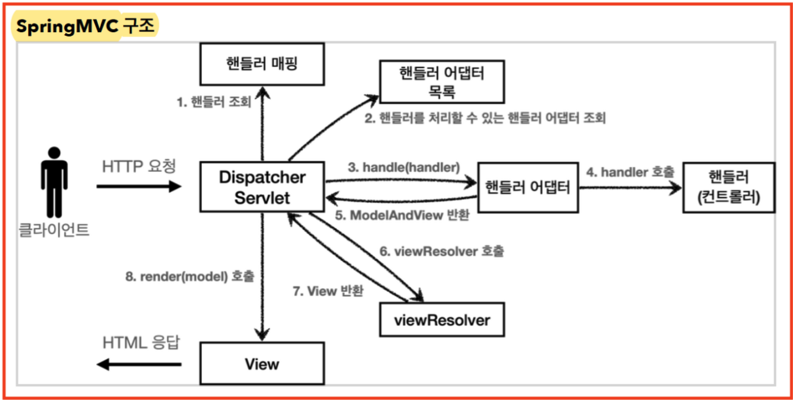
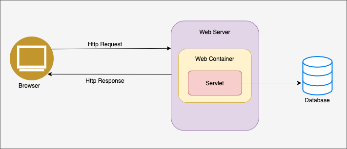
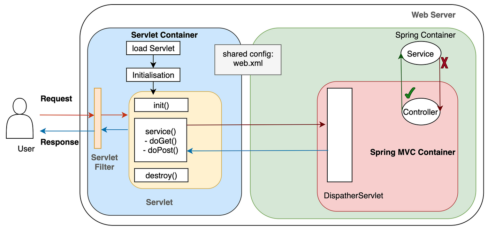
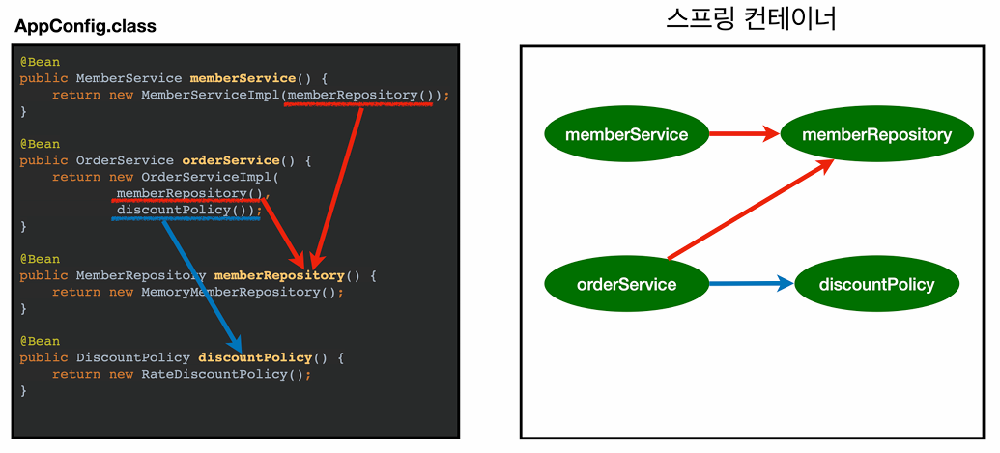

## MVC 패턴이 무엇인가요? 또 이 패턴은 어떻게 동작하나요?
    - Spring MVC 패턴은 무엇인가요?
        MVC패턴이란 애플리케이션을 세 가지 주요 구성 요소인 모델(Model), 뷰(View), 컨트롤러(Controller)로 나누어 관심사 분리를 실현하며, 코드의 유지보수성과 확장성을 높이는 구조이다.

        스프링 부트 구동시 DispatcherServlet을 서블릿으로 자동등록하며 모든 url에 대해 매핑한다.
        즉, Spring MVC는 프론트 컨트롤러 패턴으로 구현되어 있고 DispatcherServlet이 프론트 컨트롤러의 역할을 한다.
        진행 순서는 아래와 같다.

        1. 요청이 들어오면 HttpServlet.service()를 시작으로 DispatcherServlet.doDispatch()가 먼저 실행된다.
        doDispatch메서드에 HttpServletRequest, HttpServletResponse을 파라미터로 보내면서 시작한다.
        2. Handler Mapping을 통해 클라이언트의 요청에 맞는 Controller(Handler)를 찾아내고 해당 컨트롤러의 
        메서드를 호출한다. 전체적인 흐름은 요청(Http Method, url)을 통해 모든 Controller의 method들이 담겨있는 List에서 요청에 맞는 method를 찾아 리턴한다.
        3. 이제는 이 method를 실행시키기 위해 HandlerAdapter에 method를 파라미터로 
            넘겨서 실제 handler(Controller)를 호출한다. 그 후 HandlerAdapter는 컨트롤러의 응답을 ReturnValueHandler에 처리한 후
            DispatcherServlet으로 돌려준다. 컨트롤러가 ResponseEntity를 반환하면 응답 객체를 만들고 
            응답상태(HttpStatus)를 설정한다. 만약 View이름을 반환하면 ViewResolver를 통해 View를 반환한다.
        4. DispatcherServlet은 HandlerAdapter로 부터 받은 view를 View Resolver를 통해 실제 View파일을 찾고 클라이언트에 반환한다.
```
    protected void doDispatch(HttpServletRequest request, 
                              HttpServletResponse response) throws Exception {

        HttpServletRequest processedRequest = request;
        HandlerExecutionChain mappedHandler = null;
        ModelAndView mv = null;
    
        // 1. 핸들러 조회(Controller)
        mappedHandler = getHandler(processedRequest);
        if (mappedHandler == null) {
            noHandlerFound(processedRequest, response);
            return;
        }
        //2.핸들러 어댑터 조회-핸들러를 처리할 수 있는 어댑터
        HandlerAdapter ha = getHandlerAdapter(mappedHandler.getHandler());
        /**
         * 3. 핸들러 어댑터 실행 : Controller의 method 실행
         * -> 4. 핸들러 어댑터를 통해 핸들러 실행 
         * -> 5. ModelAndView 반환 mv = ha.handle(processedRequest, response, mappedHandler.getHandler()); : View나 ResponseEntity가 반환될 수 있음
         */
            mv = ha.handle(processedRequest, response, mappedHandler.getHandler()); // 실제 Controoller 실행
    
        processDispatchResult(processedRequest, response, mappedHandler, mv, dispatchException);
    }

    private void processDispatchResult(HttpServletRequest request,
        HttpServletResponse response, HandlerExecutionChain mappedHandler, ModelAndView mv, Exception exception) throws Exception {
    // 뷰 렌더링 호출
        render(mv, request, response);
    }
    
    protected void render(ModelAndView mv, HttpServletRequest request, HttpServletResponse response) throws Exception {
        View view;
        String viewName = mv.getViewName(); //6. 뷰 리졸버를 통해서 뷰 찾기
        view = resolveViewName(viewName, mv.getModelInternal(), locale, request); // 7.View 반환
        // 8. 뷰 렌더링
        view.render(mv.getModelInternal(), request, response);
    }
```

 

-----

## Servlet Container는 무엇인가요?
    - Servlet은 무엇인가요?
        서블릿이란, 웹 프로그래밍에서 클라이언트의 요청을 처리하고, 처리 결과를 클라이언트에 전송하는 기술이다.
        클라이언트는 요청을 할 때 HTTP message를 사용한다. 이 HTTP message는 아래와 같이 복잡하다. 
        과거에는 이 HTTP message를 개발자가 직접 본인이 사용할 수 있게 파싱했다. 이 불편함을 해결하기 위해 반복적인 작업을 Servlet에 맡기는 것으로
        기술을 발전했다. 또한 과거에는 웹서버가 정적인 파일(.html, css, image)만을 클라이언트에 돌려주었다.
        예를 들어 사용자마다 다른 정보가 들어있는 페이지를 보여주지 못했다는 것이다. 하지만 Servlet을 사용하면 아래와 같이
        데이터를 받아서 동적인 응답을 클라이언트에 보낼 수 있다.


```
PrintWriter out = response.getWriter();
out.println("<!DOCTYPE html>");
out.println("<html>");
out.println("<head>");
out.println("<title>환영 페이지</title>");
out.println("</head>");
out.println("<body>");
out.println("<h1>안녕하세요, " + escapeHtml(name) + "님!</h1>");
out.println("<p>동적 페이지를 성공적으로 생성했습니다.</p>");
out.println("</body>");
out.println("</html>");
```

    - Servlet Container는 사용자의 요청을 어떻게 처리하나요?
        클라이언트에서 요청이 오면 웹서버의 Servlet Container를 거치게 된다.
        그 후 Servlet은 init(), service(), destroy() 메서드를 차례로 실행한다.
        
        1. init() : 요청에 맞는 Servlet이 Servlet Container에 있는 경우 해당 Servlet을 사용하고 Container에 없는
                    경우는 Servlet객체를 생성한다. 이 과정은 서버가 켜질 때 한 번씩 실행된다.
        2. service() : HTTP message를 파싱한 HttpServletRequest와 응답할 HTTP message인 HttpServletResponse객체를 생성한다.
                        각 method에 따라 doGet, doPost 등 요청 URL과 HTTP method에 적절한 메서드를 호출하는데 파라미터로 request, reponse를 포함한다.
                        각 메서드는 정적/동적인 페이지(자바코드에 HTML코드 삽입)를 response에 넣어 클라이언트에 리턴한다. 
                        이 과정은 클라이언트에서 요청이 올 때마다 실행된다.
        3. destroy() : service 메서드, 즉 모든 로직이 끝난 경우 자원을 아끼기 위해 HttpServletRequest, Reponse를 삭제한다.


-----

## Spring Container는 무엇인가요?
    - 프론트 컨트롤러 패턴은 무엇이고, DispatcherServlet은 뭘까요?
        기존의 Servlet의 경우 모든 Servlet에 공통적으로 처리해야 할 코드가 있으면 매번 코드를 작성해야 했다. 
        반면 프론트 컨트롤러 패턴은 하나의 중간기지를 만들어서 반복된 코드를 처리하고 각 요청에 맞는 controller를 찾아 실행한다. 

        구성요소
        - 프론트 컨트롤러:
            모든 클라이언트의 요청을 최초로 받아들인다.
            요청을 분석하고 적절한 핸들러(컨트롤러)로 요청을 전달함.
        - 핸들러(Handler):
            실제 비즈니스 로직을 수행한다.
            프론트 컨트롤러로부터 요청을 받아 처리하고, View/ReponseEntity를 반환한다.
        - 뷰(View):
            사용자에게 보여질 UI를 생성한다.
            핸들러가 반환한 모델 데이터를 기반으로 최종 응답을 렌더링한다.

        이 때 중간기지 역할을 하는 것이 DispatcherServlet(FrontController)이다. 모든 요청을 하나의 DispatcherServlet이
        공통된 로직을 처리하고 각 요청에 맞는 각기 다른 Controller를 호출한다.

        주요 기능
        -요청 수신 및 분배:
            모든 클라이언트의 HTTP 요청을 수신하고, 적절한 Handler로 보낸다.
        -핸들러 매핑(Handler Mapping):
            요청 URL과 HTTP 메서드에 따라 적절한 Controller를 찾아 매핑합니다.
        -핸들러 어댑터(Handler Adapter):
            실제 Controller의 메서드를 실행해 결과를 리턴한다.
        -뷰 리졸버(View Resolver):
            컨트롤러가 반환한 String을 실제 리턴파일로 변환한다.
        -인터셉터(Interceptor):
            요청 처리 전후에 공통적인 작업(로깅, 인증 등)을 수행할 수 있는 기능을 제공한다.
        -예외 처리(Exception Handling):
            전역적인 예외 처리를 통해 일관된 에러 응답을 제공한다.

----

## spring Container은 Bean을 어떻게 관리하나요?
    ApplicationContext를 스프링 컨테이너라고 한다. 기존에는 개발자가 AppConfig를 사용해 직접 객체를 생성해서 DI 했지만, 스프링 컨테이너를 사용하면 스프링 컨테이너가 이 역할을 대신해 준다(IoC).
    @Configuration이 붙은 클래스(Config)안의 @Bean이 붙은 메서드를 호출해 반환되는 객체를 스프링 컨테이너에 등록한다. 이 객체를
    spring bean이라고 부른다. 빈 이름은 메서드명으로, 빈 객체는 메서드에서 리턴되는 객체로 설정한다. 
    빈에서 다른 빈을 참조할 때가 있는데 이 경우 spring에서 알아서 의존관계를 주입한다. 이를 통해 빈에 등록된 객체는 개발자가 직접 DI를 할 필요가 없다. 
    초기화 메서드(@PostConstruct, InitializingBean)을 통해 해당되는 빈들을 초기화 시킨다. @PreDestroy, DisposableBean 등을 통해 빈을 소멸시킨다.


https://duwjdtn11.tistory.com/443
https://velog.io/@uiurihappy/%EB%94%94%EC%8A%A4%ED%8C%A8%EC%B2%98-%EC%84%9C%EB%B8%94%EB%A6%BFDispatcher-Servlet
https://www.youtube.com/watch?v=calGCwG_B4Y