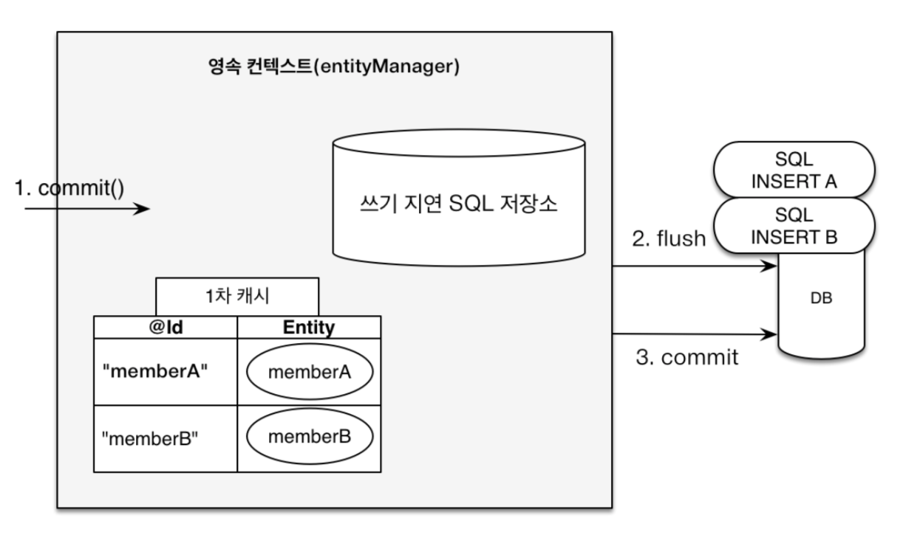

# week2

# Entity는 무엇이고 생명주기는 어떻게 되나요? 생성자 패턴이 무엇일까요?

## 1. Entity는 무엇인가요?

### 1) 영속성은 무엇일까요?

-데이터를 생성한 프로그램이 종료되어도 사라지지 않는 데이터의 특성

-애플리케이션의 상태와 상관 없도록 물리적인 저장소(HDD)를 이용해 데이터를 저장하는 행위를 영속화

-영속성을 가지지 않으면 메모리(휘발성)에만 존재하기 때문에 애플리케이션이 종료되면 데이터는 모두 사라짐

-데이터를 DB(HDD)에 영구 저장함으로서 데이터에 영속성을 부여함

**JDBC**

JDBC인터페이스 : 자바 애플리케이션에서 DB에 접근하는 방법

애플리케이션과 데이터베이스의 소통을 위한 기능(crud)들을 정의하고 있음

데이터베이스 제조사들마다 JDBC인터페이스를 구현한 클래스를 만드는데 이를 드라이버라고 함


### 2) Entity의 생명주기는 어떻게 되나요?

**동작방식**

-EntityManager.persist()

객체는 우선 1차 캐시에 저장되고 쓰기 지연 sql저장소에 insert쿼리가 등록됨, commit/flush가 되는 시점에 isnert쿼리가 DB에 반영

-EntityManager.find()

데이터 검색은 먼저 1차 캐시에 해당 객체가 있는 지 검색함. 있으면 영속성 컨텍스트에서 조회하기 때문에 쿼리문이 발생하지 않음. 만약 컨텍스트에 없으면 select쿼리를 보내 DB에서 검색함

-update

1. 영속객체는 상태 변화에 따라 update 쿼리가 생성되고 sql저장소에 update쿼리가 저장됨. 
2. 업데이트를 하기 위해서 DB에 select문을 실행하고 객체가 영속성 컨텍스트에 저장될 때 snapshot이라는 현재 상태를 저장하는 사진을 찍어둠. 
3. 해당 객체의 내용을 변하면 snapshot과 비교해 update쿼리를 쓰기 지연 sql 저장소에 저장함

-flush

영속성 컨텍스트의 내용을 데이터베이스와 동기화 하는 것을 의미

쓰기 지연 sql저장소의 쿼리문을 실행함

플러시의 3가지 방식

1. EntityManager.flush()를 직접 호출
2. 커밋하면 자동 플러시
3. JPQL 쿼리를 실행하면 자동 플러시

플러시를 실행한 이후에도 영속성 컨텍스트의 내용은 그대로 유지

**flush와 commit의 차이점 : flush는 해당 메서드를 호출한 요청서버에서만 변경사항을 확인할 수 있지만 다른 곳에서는 변경되지 않음. commit은 아예 변경**

***트랜잭션**

엔티티매니저가 생성되고 커넥션(다리)를 얻어 데이터베이스의 상태를 변화시키는 하나의 작업 단위 

-commit : 데이터를 DB에 저장하고 현재 트랜잭션을 종료

-rollback : 하나의 트랜잭션 내에서 오류가 발생할 경우 지금까지의 상황 모두를 취소시키고 원래 상태로 돌아오는 거을 의미

→ 예 : 하나의 트랜잭션 내에서 insert와 select를 수행한다면 insert가 성공적으로 실행된다고 해서 select에서 오류가 발생하면 insert, select 모두 취소함

-EntityManger

EntityMangerFactory로 인해 EntityManger가 요청마다 생성

커넥션풀에서 하나의 커넥션을 얻어 DB와 통신


**생명주기**

- 비영속 (new/transient) : 영속성 컨텍스트와 전혀 관계가 없는 새로운 상태
- 영속 (managed) : 영속성 컨텍스트에 관리되는 상태
- 준영속 (detached) : 영속성 컨텍스트에 저장되었다가 분리된 상태
- 삭제 (removed) : 삭제된 상태

```jsx
Customer customer = new Customer(1L, "kim");
em.persist(customer); // 영속 상태, 쿼리문 안 나감
em.detach(customer); // 준영속 상태
Customer findCustomer = em.find(Customer.class, 1L); // 영속성 컨텍스트에 해당 객체가 없으므로 select문 나감
findCustomer.setId(2L); // 스냅샷과 비교해서 update문을 sql저장소에 저장

tx.commit(); // 이 때 flush가 포함되기 때문에 sql저장소에서 쿼리문 나감
```



### 3) Entity에 관련된 어노테이션은 무엇이 있나요?

**-@Entity**

클래스를 DB테이블과 매핑을 시키는 역할

@Entity로 지정된 클래스는 JPA의 영속성 컨텍스트에 의해 관리

이점 : 

- 변경 감지 : 엔티티의 필드가 변경되면, 트랜잭션 커밋 시 자동으로 데이터베이스에 업데이트
- 1차 캐시 : 영속성 컨텍스트 내에서 동일한 엔티티에 대한 중복 조회를 방지하여 성능을 최적화

조건 : 

- 기본생성자 필요 : DB에서 데이터를 조회해서 데이터를 객체로 만들려면 기본생성자(new)를 통해서 만들기 때문
- final 클래스, enum, interface, inner class에는 사용 불가
- final 필드 불가

**-@Id**

엔티티 클래스 내에서 해당 필드가 데이터베이스 테이블의 기본 키임을 지정

지정된 필드는 엔티티의 고유 식별자

Id를 통해서 엔티티의 영속성을 관리

→기본 키 생성 전략 (@GeneratedValue)

GenerationType.AUTO: 

DB 방언 종류에 따라 자동으로 전략 선택하게끔함

oracle/h2는 SEQUENCE, mysql은 IDENTITY로

GenerationType.IDENTITY : 

**기본 키 생성을 데이터베이스에 위임한다.** 

삽입 시점에 기본 키가 생성, AUTO_INCREMENT

영속성 컨텍스트에서 객체를 관리하려면 pk(id)값이 반드시 있어야 함

하지만 AUTO_INCREMENT전략은 쿼리문이 나가기 전에 id값이 null이기 때문에 em.persist()하는 동시에 쓰기 지연 sql저장소에 저장하는 것이 아니라 insert쿼리가 바로 DB로 전송됨. DB에서 식별자 값을 받아서 영속성 컨텍스트에 엔티티를 등록함

GenerationType.SEQUENCE

키 생성 전용 테이블을 하나 만든다

id의 초기값과 사이즈를 조절할 수 있음

시퀀스를 통해 id값을 증가시킴

## 2. Entity 객체 생성 방법으로 무엇이 있을까요?

### **1) 생성자**로 적용했을 때의 특징은 무엇인가요?

**특징**

- 직접 초기화: 클래스의 생성자를 통해 엔티티 객체를 직접 초기화
- 단순성: 기본적인 객체 생성 방식으로, 이해하기 쉽고 구현이 간단
- 복잡함 : 모든 필드를 생성자에서 초기화해야 하기 때문에, 필드가 많아지면 생성자가 복잡해질 수 있습니다.
- 유연성 부족: 객체 생성 과정에서 복잡한 로직이나 검증을 추가하기 어려움

```java
public User(String username, String email) {
    this.username = username;
    this.email = email;
}

```

### **2) 팩토리 메서드**로 적용했을 때의 특징은 무엇인가요?

**특징**

- 캡슐화: 객체 생성 로직을 메서드 내부에 캡슐화하여 외부에서 객체 생성 방식을 숨길 수 있음
- 유연성 증가: 필요에 따라 메서드 내부에서 다양한 기능을 추가해 다양한 객체 생성 방식을 제공할 수 있다
- 추가적인 메서드 필요: 생성자 외에 별도의 메서드를 정의해야 하므로 코드가 복잡해지고 길어진다

```jsx
public static User createUser(String username, String email) {
	  return new User(username, email);
}
```

### **3) 빌더 패턴**로 적용했을 때의 특징은 무엇인가요?

생성자, 팩토리 패턴의 가장 큰 문제점은 유연함이다. 클래스의 필드가 총 5개라면 원하는 필드의 값만큼 원하는 객체를 생성하기 위해선 너무 많은 생성자/메서드가 필요하다.

또한 setter의 가장 큰 문제점은 불변성을 깬다는 것이다. 이미 만들어진 객체의 필드값을 불변성을 유지하고 싶은데 setter는 이를 위반한다.

위 두가지 문제점을 해결할 수 있는 패턴이 빌더 패턴이다. 

**특징**

유연한 객체 생성: 선택적 매개변수를 포함한 복잡한 객체를 단계별로 생성
불변 객체 생성 용이: 빌더 패턴을 통해 불변성을 유지
추가적인 코드 작성: 빌더 클래스를 별도로 작성해야 하므로 코드량이 증가(하지만@Builder로 해결 가능)

```java
Board board = Board.builder()
	.title(afterBoard.getTitle())
	.content(afterBoard.getContent()).updateDate(LocalDateTime.now()).build();
```