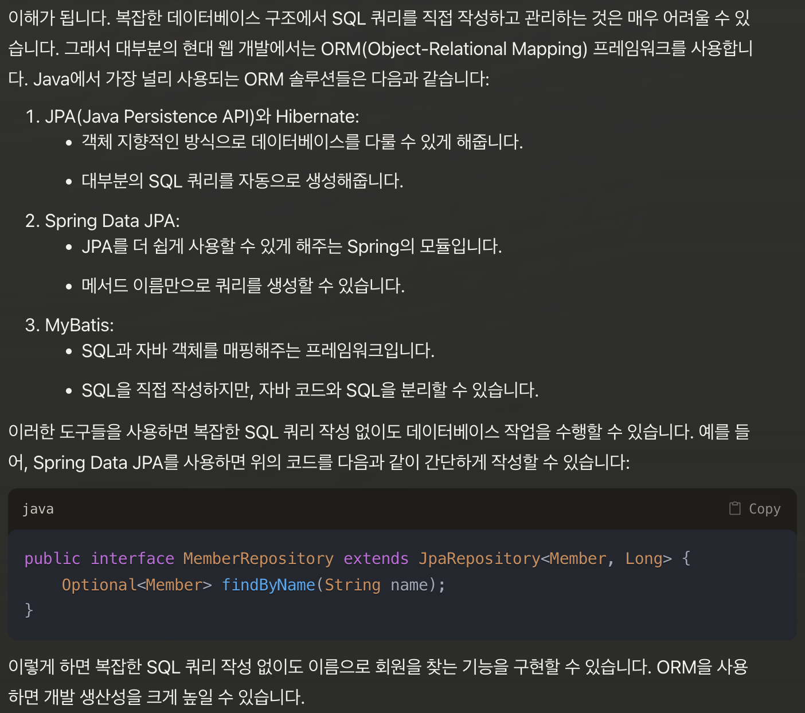
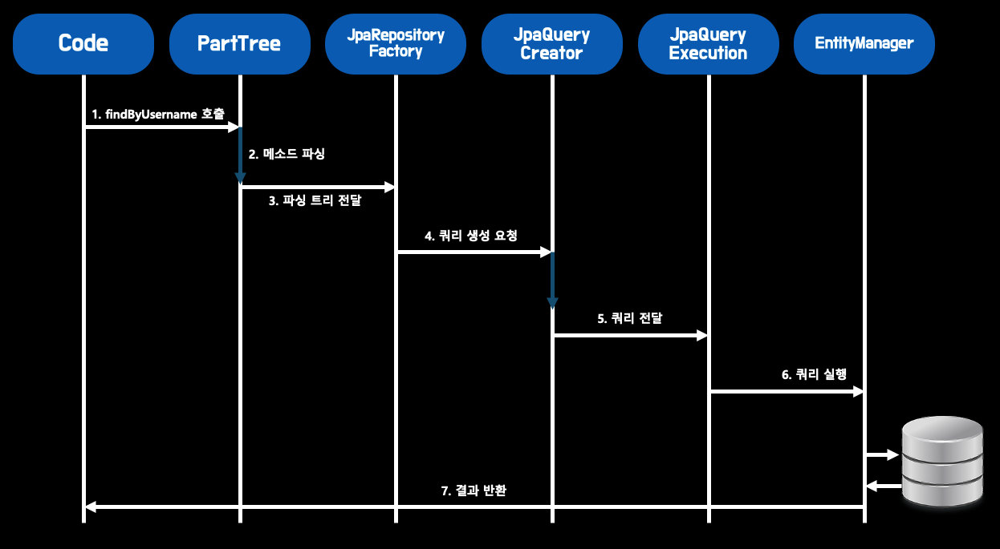
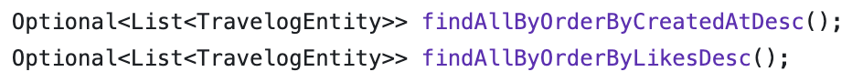
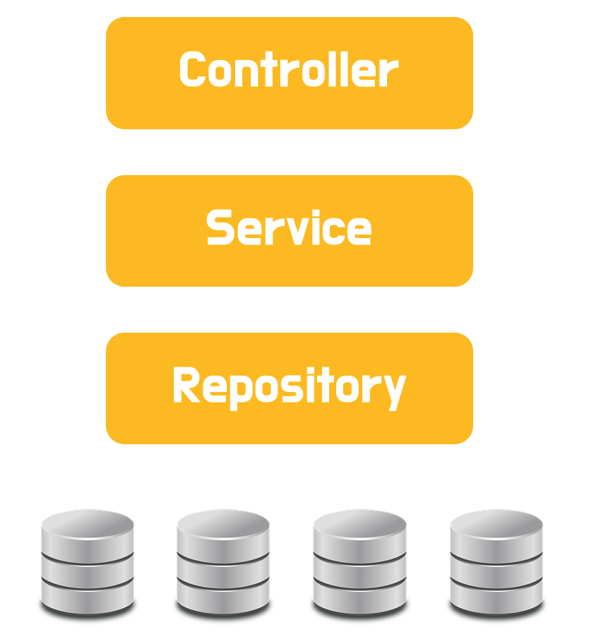
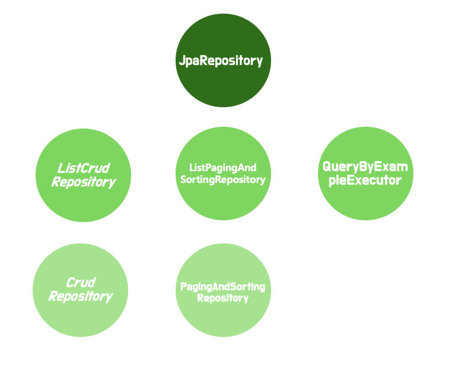

# 2회차

### ORM은 무엇일까요? 스프링에서 ORM을 어떻게 이용할 수 있을까요?

1. ORM은 무엇이고 왜 필요할까요?
2. 스프링에서 ORM을 어떻게 활용하나요?
    1. Spring Data JPA란 무엇일까요?
    2. Repository Layer란 무엇일까요?
    3. JpaRepository 인터페이스에는 어떤 기능들이 포함되어 있나요?
3. 연관관계 매핑은 무엇이고 어떻게 이용할 수 있을까요?
    1. 연관관계 매핑은 왜 이용할까요?
    2. 연관관계 매핑에는 무엇이 있을까요?
    3. 영속성 전이는 무엇이고 어떻게 활용할 수 있을까요?

## 1. ORM은 무엇이고 왜 필요할까요?

<aside>
💁🏻‍♂️

**ORM(Object Relational Mapping)이란 객체와 데이터베이스 테이블을 연결해주는 기술**입니다.

</aside>

아래, 춘식이가 만든 웹사이트의 members 데이터베이스 테이블의 모습입니다.

| ID(PK) | user_id | password | name | age | gender | phnum |
| --- | --- | --- | --- | --- | --- | --- |
| 1 | xunssoie | aqeoihfbad | 한준서 | 24 | male | 010-0000-0000 |
| 2 | jihyungleee | adsfqghh | 이지형 | 24 | male | 010-1111-1111 |
| 3 | hanipham | uyoiuyoe | 팜하니 | 20 | female | 010-2222-2222 |
| 4 | mjkim | bnmcbiuqy | 김민지 | 20 | female | 010-3333-3333 |

그리고 클라이언트에서 김민지라는 사용자에 대해 GET 요청을 서버에 날렸다고 가정해봅시다.<br><br>

그럼 `Controller`가 요청을 받아 `Service`를 호출하고 `Repository`를 통해 데이터베이스의 데이터에 접근하여 `김민지`라는 `name`을 가진 사용자의 정보를 반환할겁니다.

<br>
춘식이는 데이터베이스 강의 시간에 배웠던 지식을 활용하여 아래와 같이 `Query` 를 작성하였습니다.

```sql
SELECT id, name FROM members WHERE name = '김민지';
```

춘식이는 `ChatGPT`에게 **쿼리문을 데이터베이스에 보내는 법**을 검색하였고, 지피티는 아래 코드로 답변했습니다.

~~이전에 ORM을 공부했던 과정에서 직접 작성한 코드입니다.~~

```java
    public Optional<Member> findByName(String name) {
        String sql = "select * from member where name = ?";
        Connection conn = null;
        PreparedStatement pstmt = null;
        ResultSet rs = null;
        try {
            conn = getConnection();
            pstmt = conn.prepareStatement(sql);
            pstmt.setString(1, name);
            rs = pstmt.executeQuery();
            if(rs.next()) {
                Member member = new Member();
                member.setId(rs.getLong("id"));
                member.setName(rs.getString("name"));
                return Optional.of(member);
            }
            return Optional.empty();
        } catch (Exception e) {
            throw new IllegalStateException(e);
        } finally {
            close(conn, pstmt, rs);
        }
    }
```

`findByName`이라는 메소드를 작성하고, **데이터베이스 연결부터 쿼리문 작성, 쿼리 전송**까지 춘식이가 모두 처리해줘야했습니다.

춘식이는 이렇게 생각했습니다.

<aside>
❓

음. 데이터베이스 `CRUD` 작업을 하려면, 데이터베이스를 연결해 쿼리문을 직접 작성하고 날려줘야겠군..

</aside>

춘식이가 쿼리 지옥에서 고생하다 더이상 못버티고 `ChatGpt`에게 아래와 같이 질문했습니다.

*항상 이렇게 내가 쿼리문을 작성해야해?? 이거 테이블이 늘어나고 ERD가 복잡해질 수록 쿼리문 작성하기가 너무 힘든걸.. 백앤드 못하겠어!*

아래는 위 질문에 대한 실제 클로드의 답변입니다.



`ORM`은 **객체 - 데이터베이스 테이블** 매핑을 통해 데이터베이스 `CRUD`를 쉽게 조작할 수 있도록 하는 프레임워크입니다. 그 길었던 `findByName` 메소드가 `ORM`을 통해 아래의 코드 한 줄로 대체될 수 있었던 것이죠.

~~구체적인 동작은  ***b.Spring Data Jpa란 무엇일까요?*** 에서 다루도록 하겠습니다.~~

```java
Optional<Member> findByName(String name);
```

`ORM`은 정말 좋은 기술이긴하지만, 몇가지 장단점이 존재합니다. 간단하게 알아보겠습니다.

1. **장점**
- **생산성**
    - 쿼리문 작성에 대한 부담이 감소
    - SQL 반복 작업 필요 X
- **유지보수**
    - 만약, 데이터베이스 테이블의 속성값이 변경되었다면, 관련 `ORM` 메소드, 객체의 `name`, `Parameter` 타입만 변경하면 됩니다.
- **DB 타입에 종속 X**
    - 각 데이터베이스마다 쿼리 작성, 문법 등과 같은 사용 방식이 달라서 개발 중 데이터베이스를 교체하기 위해서는 위험부담이 매우 컸지만, `ORM`은 추상화된 데이터베이스 접근 계층을 제공하기 때문에, 관련 설정파일을 수정하기만 하면 손쉽게 데이터베이스를 교체할 수 있습니다.

1. **단점**
- 성능
    - `findByName`이라는 메소드 이름으로 쿼리문을 대체할 수 있었지만, 개발자가 직접 작성하지 않을 뿐, `ORM`이 **메소드 이름 → 쿼리문 로 전환하는 부가 동작은 여전히 필요**합니다.
- 정밀도
    - 쿼리를 직접 작성하는 것이 아니기 때문에, ORM에서 객체간 매핑이 잘못되거나, 잘못 사용하여 의도하지 않은 동작이 수행될 수도 있습니다.

---

## 2. 스프링에서 ORM을 어떻게 활용하나요?

### a. Spring Data JPA란 무엇일까요?

`JPA`란 자바에서 `ORM` 기술의 표준으로 사용하는 인터페이스의 모음을 의미합니다. 말 그대로 인터페이스입니다.

그럼 `Spring Data Jpa`는 무엇일까요?

`Spring Data Jpa`는 스프링 프레임워크의 일부로, `Jpa`를 활용하기 쉽게 만들어주는 추상화 계층입니다. 그리고 내부적으로 `Hibernate`를 사용하지만, **간단하게 다른 `Jpa` 구현체로 교체**할 수 있습니다.

Spring Data JPA에 대한 공식문서를 참고했을 때, 다음과 같은 주요 기능을 제공한다고 합니다.

- **레포지토리 인터페이스 자동 구현 및 다양한 쿼리 메소드 지원**

    ```java
    @Repository
    public interface UserRepository extends JpaRepository<User, Integer> {
        Boolean existsBySchoolEmail(String schoolEmail);
    
        Optional<User> findBySchoolEmail(String schoolEmail);
    
        Page<User> findAll(Pageable pageable);
    
        Boolean existsByNickname(String nickname);
    
        Optional<User> findByNickname(String nickname);
    }
    ```

  위 코드는 제가 프로젝트에서 실제 사용한 `UserRepository` 코드의 일부입니다. `JpaRepository`를 상속받는 것만으로도 기본적인 `CRUD`가 가능하지만, **쿼리 메소드를 커스텀**해 더욱 다양하게 사용할 수 있습니다.
  <br><br>
    1. **기본 키워드**

  | 키워드 | 설명 | 예시 |
      | --- | --- | --- |
  | `existsBy...` | 조건에 맞는 엔티티 존재 여부 확인 | `existsBySchoolEmail(String email)` |
  | `findBy...` | 조건에 맞는 엔티티 검색 | `findByNickname(String nickname)` |
  | `countBy...` | 조건에 맞는 엔티티 수 반환 | `countByAge(int age)` |
  | `deleteBy...` | 조건에 맞는 엔티티 삭제 | `deleteByUsername(String username)`  |

    1. **조건 연산자**

  | 키워드 | 설명 | 예시 |
      | --- | --- | --- |
  | `And` | 여러 조건을 AND로 결합 | `findByFirstNameAndLastName(String firstName, String lastName)` |
  | `Or` | 여러 조건을 OR로 결합 | `findByAgeOrName(int age, String name)` |

    1. **비교**

  | 키워드 | 설명 | 예시 |
      | --- | --- | --- |
  | `LessThan` | 작은 값 | `findByAgeLessThan(int age)` |
  | `GreaterThan` | 큰 값 | `findByAgeGreaterThan(int age)` |
  | `Between` | 범위 내 값 | `findByAgeBetween(int start, int end)` |

    1. **특정 조건 추가**

  | 키워드 | 설명 | 예시 |
      | --- | --- | --- |
  | `Contains` | 포함 | `findByNameContaining(String name)` |
  | `StartsWith` | ~로 시작 | `findByNameStartsWith(String prefix)` |
  | `EndsWith` | ~로 끝남 | `findByNameEndsWith(String suffix)` |

    1. **정렬**

  | 키워드 | 설명 | 예시 |
      | --- | --- | --- |
  | `OrderBy...Asc` | 오름차순 정렬 | `findByAgeOrderByNameAsc(int age)` |
  | `OrderBy...Desc` | 내림차순 정렬 | `findByAgeOrderByNameDesc(int age)` |

    1. **결과값 조건 추가**

  | 키워드 | 설명 | 예시 |
      | --- | --- | --- |
  | `First`, `Top` | 첫 번째 결과 | `findFirstByOrderByAgeDesc()` |
  | `Distinct` | 중복 제거 | `findDistinctByLastName(String lastName)` |
    1. **결과값 조건 추가**

  | 키워드 | 설명 | 예시 |
      | --- | --- | --- |
  | `Optional<T>` | 결과값이 없을  수 있는 경우 | `Optional<User> findBySchoolEmail(String schoolEmail)` |
  | `List<T>` | 리스트로 반환 |  |
  | `Page<T>` | 페이징으로 반환 |  |

  **(번외). 반환타입**

    - `Optional<T>`: 결과가 없을 수 있는 경우
    - `List<T>`: 여러 결과를 리스트로 반환
    - `Page<T>`: 페이지네이션 결과 반환

  예: `Optional<User> findBySchoolEmail(String schoolEmail)`

    ### 메소드 이름 → 쿼리 과정
    
    이 기능은 `Spring Data` 애플리케이션의 핵심적인 기능 중 하나입니다.
    
    > 🧸 예를 들어, 춘식이가 ***findByUsername 메소드를 만들고, 호출***한 상황을 가정해봅시다<br>
    
    1. `findByUsername` 호출
       2. `Spring Data JPA`의 `PartTree` 클래스가 해당 메소드 이름을 `find`, `By`, `username`으로 분리
       3. find, By, username을 `트리`로 변환하고 `JpaRepositoryFactory`에게 전달
       4. 전달받은 트리를 통해 `JpaQueryCreator`에게 **실제 쿼리로 전환해달라고 요청**
       5. 해당 쿼리는 `JpaQueryExecution`에게 전달.
       6. `EntityManager`가 실제 이 쿼리를 데이터베이스에 전송
           - `EntityManager`는 **JPA의 핵심 인터페이스 중 하나로 데이터베이스와의 모든 상호작용을 관리**하는 역할을 합니다.
       7. 반환값이 `EntityManager`를 통해 JPA 계층에 전달되고, 최종적으로 메소드를 호출한 Line의 반환값으로 전달<br><br>
    
         
    
    <br>`ORM`에서 설명드린 **메소드이름 → 쿼리**가 바로 이렇게 실행됩니다!
    
    ### `Optional<T>`과 `List<T>` 사용시 주의할 점
    
    `Optional`은 쿼리 메소드의 **반환값이 null일 경우**를 예상하여, `NullPointException`의 발생을 방지하고 다른 메소드들(orElse, orElseThrow 등)로 유연하게 처리하기 위해 자주 사용되는 `레퍼클래스`입니다.<br><br>
    
    정확하게는 만약 쿼리 메소드의 반환값이 `null`일 경우 `Optional.empty()`를 반환하며, `Optional`의 메소드 체인(**orElse, orElseGet, orElseThrow 등**)을 사용하는 구조로 동작합니다.<br><br>
    
    그럼, `Optional<T>`의 제네릭을 List<T>로 가져가면 어떻게 될까요? 아래 예시를 살펴봅시다.
    
    <br><br>
    
    `findAllByOrderByCreatedAtDesc()`의 결과값은 `null`이 될 수 없습니다. 찾고자 하는 `value`가 존재하지 않는다면, `null`이 아니라 빈 `List`를 반환하기 때문이죠.<br><br>
    
    그렇다면 `Optional`로 `List`를 감싸는 형식의 반환은 적절하지 않습니다. `Optional`은 반환값이 `null`일 경우에 의도대로 동작하지만, 반환값이 `null`일 경우가 없기 때문입니다. 따라서 아래와 같이 코드를 작성하고 설계하는 것이 올바른 설계입니다.
    
    ```java
    List<TravelogEntity> findAllByTitleContainingOrderByCreatedAtDesc(String location);
    List<TravelogEntity> findAllByTitleContainingOrderByLikesDesc(String location);
    ```

- `@Query`으로 작성된 쿼리의 유효성 검사

    ```java
    public interface UserRepository extends JpaRepository<User, Long> {
        @Query("SELECT u FROM User u WHERE u.name = :name AND u.gender LIKE %:gender%")
        List<User> findUsersCustom(@Param("name") String name, @Param("gender") String gender);
    }
    ```

  `@Query`를 통해 쿼리를 커스텀해 쿼리메소드를 작성하는 경우, `Spring Framework`에서 자동으로 해당 쿼리에 대한 **문법오류, 엔티티와 테이블 간의 유효성 검사, 파라미터 바인딩** 등을 검사한다고 합니다.


### b. Repository Layer란 무엇일까요?

SpringData JPA를 살펴보면서 `Repository`가 잠깐 등장하였는데요.



`Repository`는 비지니스 로직에 따라, **데이터베이스에 접근하여 데이터에 대한 CRUD를 수행**하는 계층입니다. `Repository` 계층을 비지니스 로직과 분리하면서 다음과 같은 이점을 얻을 수 있습니다.

- **코드 가독성 증가**
- **데이터 접근 로직 분리로 코드 재사용성 증가**
- **유지보수성 증가**
    - 데이터베이스 스키마 수정시 `Repository` 레이어만 수정하여 `Update` 가능

### c. JpaRepository 인터페이스에는 어떤 기능들이 포함되어 있나요?



`JpaRepository`는 `ListCrud`, `ListPaginAndSorting`, `QueryByExapleExecutor`와 같은 여러 인터페이스를 상속받아, 보다 다양한 기능을 제공합니다.

실제로 `JpaRepository` 만의 메소드는 `saveAndFlush`, `deleteInBatch`와 같이 드물게 사용하는 메소드일 뿐, 실제 많이 사용하는 메소드는 `CrudRepository`에 대부분 정의되어 있고, 연쇄적으로 상속받아 사용하는 구조로 `JpaRepository`를 활용하게 됩니다. (`save`, `findById`, `exitsById`, `count` 등)

---

## 3. 연관관계 매핑은 무엇이고 어떻게 이용할 수 있을까요?

### a. 연관관계 매핑은 왜 이용할까요?

OOP 애플리케이션에서 관계형 데이터베이스를 사용할 때 주로 앤티티 단위로 테이블을 설계하고 사용합니다. 이 때, **앤티티와 앤티티 사이의 관계를 정의**하는데 사용되는 개념이 바로 연관관계 매핑입니다.

연관관계 매핑을 설정해둔다면, 데이터베이스 연산에서 자원적 이점을 가져갈 수 있습니다. 조금 더 쉽게 이해하기 위해 예시를 한번 들어보겠습니다.

<aside>
🎁

`Username`이 `xunssoie`인 유저의 구매 목록을 조회하고자 합니다.

</aside>

1. **연관관계 매핑을 하지 않은 경우**

    ```java
    @Entity
    public class User {
        @Id
        private Long id;
        private String username;
    }
    
    @Entity
    public class Purchase {
        @Id
        private Long id;
        private Long userId;
        private String productName;
    }
    
    // 사용 예
    User user = userRepository.findByUsername("xunxxoie");
    List<Purchase> purchases = purchaseRepository.findByUserId(user.getId());
    ```


1. **연관관계 매핑을 하지 않은 경우**

    ```java
    @Entity
    public class User {
        @Id
        private Long id;
        private String username;
        
        @OneToMany(mappedBy = "user")
        private List<Purchase> purchases;
    }
    
    @Entity
    public class Purchase {
        @Id
        private Long id;
        
        @ManyToOne
        @JoinColumn(name = "user_id")
        private User user;
        
        private String productName;
    }
    
    // 사용 예
    User user = userRepository.findByUsername("xunxxoie");
    List<Purchase> purchases = user.getPurchases();
    ```


연관관계를 설정해두면, 코드 상으로 조금 더 간결해지고 추후에 erd를 설계할 때에도 객체 간의 관계를 파악하기에도 용이하다고 할 수 있습니다.

<aside>
❓

그럼 단순히 코드의 가독성, 설계의 단순화 때문에 연관관계 매핑을 적용할까요?

</aside>

**아닙니다.** 사실 저 코드 상으로는 굳이 연관관계 매핑을 하지 않아도 성능상 큰 차이가 없어보이지만, **비지니스 로직이 복잡해지고 대량으로 데이터를 처리하는 경우**에는 연관관계 매핑의 최적화 기법을 사용한다면, **더 나은 성능을 발휘**할 수 있습니다.

- **여담**

  몇몇 영상을 시청하다보니, 연관관계 매핑에 대한 **부정적인 반응**들이 있었습니다.

  **김영한님 + 제이니님 피셜 연관관계 지침**

    - **양방향 걸지 않는다.**
    - **단방향만 건다.**
    - **단방향도 어지간하면 One To Many 안건다.**
    - **One To One 안건다.**
    - **생명주기가 완전히 같다면 연관관계를 거는 것을 ‘고민’한다.**
    - **그중에도 특히 양방향을 떡칠하면, 답이 없다.**<br><br>

  실무에서도 저런 비슷한 연관관계에 대한 지침들이 존재한다고 하는데요. 연관관계 매핑을 최대한 지양하고 꼭 필요한 경우에만 사용한다고 하네요.<br><br>

  <br><br>

  비록 제가 실무에서 작업을 진행한 적도 없고 그만큼 복잡한 ERD를 설계한 적도 없지만, 대충 어떤 흐름에서 이런 이야기를 하는지 이해가 갈 것 같습니다.<br><br>

  사실 객체와 객체 사이에 연관관계가 한 쌍으로 존재하는 것 뿐만 아니라, 연쇄적으로 그 관계가 얽혀있다면 유지보수 측면에서, 구조를 설계하는 측면에서 난해해지는 것은 사실인 것 같습니다.


### b. 연관관계 매핑에는 무엇이 있을까요?

연관관계 매핑시, 고려해야할 점이 총 3개가 있습니다. **방향, 주인, 다중성**인데요. 차례대로 살펴봅시다.

1. **방향**
    1. **단방향 관계**

       **→ A라는 엔티티만 B라는 엔티티를 참조**하는 관계를 의미합니다. 즉, A 엔티티가 B 엔티티를 단방향으로 참조한다면, **코드상으로는 B 엔티티를 A 엔티티의 인스턴스로 갖고 있음**을 의미합니다.<br><br>

    2. **양방향 관계**

       → **A와 B엔티티가 서로를 참조**하는 관계를 의미합니다. 스프링에서는 **A와 B 엔티티가 서로를 인스턴스로 갖고 있음**을 의미합니다.<br><br>

2. **주인**

   양방향 관계에서 **`주인`은 두 엔티티 사이를 관리하는 권한을 갖고 있는 주체**를 의미합니다. **보통 외래키를 갖고 있는 쪽이 주인**이 되는데요. 반대로 주인이 아닌 엔티티는 `@mappedBy` ***어노테이션을 통해 지정***해줘야합니다.<br><br>

   코드 상에서 살펴보도록 합시다.

    ```java
    @Entity
    @Getter@Setter
    public class Team {
        @Id @GeneratedValue
        private Long id;
        
        private String name;
        
        @OneToMany(mappedBy = "team")
        private List<Player> players = new ArrayList<>();
        
    }
    ```

    ```java
    @Entity
    @Getter@Setter
    public class Player {
        @Id @GeneratedValue
        private Long id;
        
        private String name;
        
        @ManyToOne
        @JoinColumn(name = "team_id")
        private Team team;
        
    }
    ```

   `Player` 엔티티는 `Team`에 대한 `Get`, `Set`과 같은 `CRUD` 작업을 수행할 수 있으며,  이를 **Player*가* Team*의 주인이다*** 라고 표현할 수 있습니다.<br><br>

   보통은 `@JoinColumn` 어노테이션으로 **외래키를 갖고 있는 엔티티가 주인**, `mappedBy` 속성을 갖고 있는 엔티티는 주인이 아닌 앤티티다 라고 생각하시면 될 것 같습니다.<br><br>

3. **다중성**<br><br>

   연관관계 매핑의 종류는 다음과 같습니다.

    - **One To One - 1 : 1, 일대일 관계**
    - **~~One To Many - 1 : N, 일대다 관계~~**
    - **Many To One - N : 1, 다대일 관계**
    - **~~Many To Many - N : M, 다대다 관계~~**<br><br>

ERD 설계와 엔티티 간의 특성을 고려하여 필요시, 적절한 관계를 설정하여 활용할 수 있습니다. 각 연관관계 매핑에 대해 살펴봅시다.

**a. One To One**

**일대일 관계**란 **두 앤티티 간의 관계가 1:1로 매핑되는 관계**를 의미합니다. 예를 들어, 한 명의 사람에게는 하나의 주민등록증이 주어집니다. 이렇게 ***한 앤티티에게 오직 하나의 다른 앤티티만이 할당될 수 있는 관계***를 일대일 관계라고 합니다.

`@OneToOne`을 통해 다른 앤티티와 일대일 관계를 지칭할 수 있습니다.

- 단방향

    ```java
    @Entity
    public class Person {
        @Id
        @GeneratedValue(strategy = GenerationType.IDENTITY)
        private Long id;
    
        private String name;
    
        @OneToOne
        @JoinColumn(name = "id_card_id")
        private IdCard idCard;
    }
    
    @Entity
    public class IdCard {
        @Id
        @GeneratedValue(strategy = GenerationType.IDENTITY)
        private Long id;
    
        private String cardNumber;
    }
    ```

- 양방향

  `@JoinColumn` 은 **외래키 참조(** *~~= 상대 엔티티의 아이디를 갖고 있는 것~~***)를 의미**합니다. 즉 현재 외래키를 갖고 있는 `Person` 객체가 주인의 위치에 있다라고 생각하시면 됩니다.

    ```java
    **@Entity
    public class Person {
        @Id
        @GeneratedValue(strategy = GenerationType.IDENTITY)
        private Long id;
    
        private String name;
    
        @OneToOne(cascade = CascadeType.ALL)
        @JoinColumn(name = "id_card_id")
        private IdCard idCard;
    
    }
    
    @Entity
    public class IdCard {
        @Id
        @GeneratedValue(strategy = GenerationType.IDENTITY)
        private Long id;
    
        private String cardNumber;
    
        @OneToOne(mappedBy = "idCard")
        private Person person;
        
    }**
    ```


**b. Many To One**

**다대일 관계**는 **학생들과 담임선생님의 관계**처럼 **여러 앤티티에 한 앤티티가 할당되는 관계**를 의미합니다.

<aside>
🙉

다대일 관계에서 ***다*에 해당하는 엔티티가 외래키를 갖습**니다.

</aside>

- 다대일 단방향

    ```java
    @Entity
    @Getter @Setter
    public class Student {
        @Id @GeneratedValue(strategy = GenerationType.IDENTITY)
        private Long id;
        
        private String name;
        
        @ManyToOne(fetch = FetchType.LAZY)
        @JoinColumn(name = "teacher_id")
        private Teacher teacher;
    }
    
    @Entity
    @Getter @Setter
    public class Teacher {
        @Id @GeneratedValue(strategy = GenerationType.IDENTITY)
        private Long id;
        
        private String name;
    }
    ```

- 다대일 양방향

  양방향 관계에서는 마찬가지로 `주인`을 지정해줘야하는데, 기존 방식과 동일하게 `@JoinColumn`과 `mappedBy` 속성을 활용해 관계를 형성할 수 있습니다.

    ```java
    @Entity
    @Getter @Setter
    public class Student {
        @Id @GeneratedValue(strategy = GenerationType.IDENTITY)
        private Long id;
        
        private String name;
        
        @ManyToOne(fetch = FetchType.LAZY)
        @JoinColumn(name = "teacher_id")
        private Teacher teacher;
    }
    
    @Entity
    @Getter @Setter
    public class Teacher {
        @Id @GeneratedValue(strategy = GenerationType.IDENTITY)
        private Long id;
        
        private String name;
        
        @OneToMany(mappedBy = "teacher")
        private List<Student> students = new ArrayList<>();
    }
    ```


**c. One To Many, Many To Many**

- **One To Many**

    <aside>
    🤔

  일대다 관계와 다대일 관계의 차이는 무엇이고, 왜 다대일 관계를 주로 사용할까요?

    </aside>

  다대일 관계에서 `주인`은 `다`에 해당하는 엔티티였습니다. 반대로 **일대다 관계에서는 일에 해당하는 앤티티가 `주인`**이 됩니다.<br><br>

  `일대다 관계`에도 양방향/단방향 관계가 각각 존재합니다. 하지만 실제로는 **일대다 단방향을 사용하는거 대신 다대일 양방향 관계 사용을 지향**하며, 심지어 일대다 양방향 관계는 JPA에서 지원하지도 않습니다.<br><br>

  ~~사실 속성값을 설정해 사용할 수 있지만 매우매우 권장하지 않는다고 합니다.~~<br><br>

  그 이유는 `성능`과 `유지보수` 측면에서 찾아볼 수 있습니다. 일대다 관계에서 **‘다’에 해당하는 엔티티를 수정할 때, JPA는 관련되어 있는 모든 ‘일’에 해당하는 엔티티를 업데이트**해야 합니다. 이에 따라 부가적인 SQL 쿼리 수정이 발생하며, 성능 저하를 일으킵니다.<br><br>

  무엇보다 **일대다 양방향관계**는 관계를 파악하고 관리하기가 어렵습니다..!!!<br><br>

- **Many To Many**

  다대다 관계에 대한 참고자료를 찾아보면서, 공통적인 특징을 발견할 수 있었는데요.

  포스팅 빌드업이 **다대다 관계 생성 → 문제 발생 → 다대다 관계를 사용하지 않는 방법 이더라구요.. ㅋㅋ**<br><br>

  <br><br>

  다대다 관계 매핑을 생성하면, 중간 테이블을 별도의 앤티티로 생성해야하고, 이에 대한 부담이 증가합니다. 결정적으로 다대일, 일대다로 풀어내서 객체지향적으로 설계할 수 있기 때문에, 사용을 최대한 지양합니다.


### c. 영속성 전이는 무엇이고 어떻게 활용할 수 있을까요?

`영속성`은 무엇일까요? 영생, 영구, 영속 무언가 *영원하다~* 라는 느낌이 나지 않나요?

`Persistence` 즉 영구의 개념으로 `영속성`은 **오래도록 혹은 영구적으로 남아있는 성질**을 의미합니다. 간단히 요약하면 **부모 엔티티의 상태 변화를 자식 엔티티에도 자동으로 적용하여, 연관된 엔티티들의 생명주기를 함께 관리하는 JPA의 기능**이라고 정의할 수 있을 것 같습니다.

이어서 `영속성 전이`에 대해 이해하기 위해 간단한 예시를 들어보겠습니다.

<aside>
🤔

춘식이는 이번 프로젝트에서 게시글과 코멘트의 CRUD를 담당하였습니다.

</aside>

근데 게시글에 대한 `DELETE`를 수행하면, 코멘트까지 함께 삭제되는게 일반적인 흐름인데.. 그럼 *게시글이 삭제되기 전에 아이디를 받아오고 → 데이터베이스를 뒤져서 해당 아이디 값을 FK로 갖고 있는 댓글들을 모두 찾아 삭제???*

이렇게 되면 **데이터베이스 연산이 굉장히 늘어나고 자원적으로도 부담**이 될겁니다. 이런 부담을 줄여줄 수 있는 기능이 바로 `영속성 전이`인데요.

`cascade` 속성을 적절히 설정하여 부모 엔티티와 자식 엔티티 간의 상태변화를 유동적으로 제어할 수 있습니다.

연관관계 매핑 중 다대일, 일대다 관계에서 `cascade` 옵션을 설정할 수 있는데요

- `ALL`: 모든 Cascade 작업을 적용
- `PERSIST`: 엔티티 영속화 시 연관 엔티티도 함께 영속화
- `REMOVE`: 엔티티 제거 시 연관 엔티티도 함께 제거
- `MERGE`: 엔티티 병합 시 연관 엔티티도 함께 병합
- `REFRESH`: 엔티티 새로고침 시 연관 엔티티도 함께 새로고침
- `DETACH`: 엔티티 분리 시 연관 엔티티도 함께 분리

단일 옵션으로 사용할 수 있고, 한 개 이상의 옵션(ALL 옵션을 제외하고)을 선택하여 아래와 같이 복수적으로도 적용할 수 있습니다!

```java
@OneToMany(cascade = {CascadeType.PERSIST, CascadeType.REMOVE})
private List<commentEntity> comment;
```