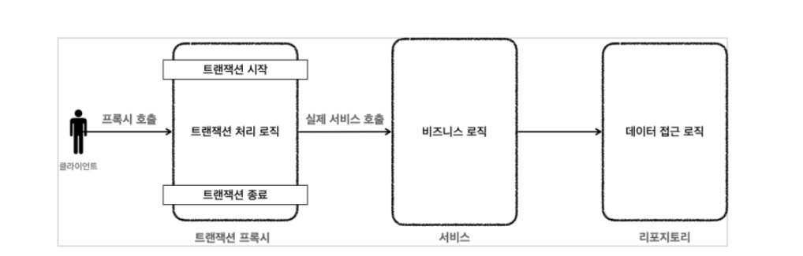

# Service Layer는 무엇인가요? DTO와 VO의 차이점은 무엇인가요? Logging은 무엇인가요?

## 1. Service Layer는 무엇을 하는 계층이며 어떤 역할인가요?

- 비즈니스 로직 처리: 사용자의 요구사항을 해결하기 위한 실질적 코드
- 트랜잭션 관리: 데이터 일관성 유지 및 롤백 등 트랜잭션 관련 기능을 구현
- 다른 레이어 간의 중재 : controller는 비즈니스 로직에 대해 알 필요X

## 2. Spring에서 데이터 전달 객체로 무엇이 있나요?

### 1) 데이터 전달 객체를 왜 사용하나요?

1. Entity의 모든 속성이 외부에 노출된다.
    
    민감한 정보가 외부에 노출되는 보안 문제
    
2. 요청과 응답 객체가 항상 엔티티와 같지는 않다.
    
    Entity는 요청에서 사용하지 않을 불필요한 데이터까지 보유
    
3. Controller 계층에서 엔티티의 메서드를 호출하거나 상태를 변경시킬 위험이 존재한다.
    
    Controller에서 실수로 Entity의 Setter를 사용하여 Entity의 상태가 변경될 위험이 있음
    
4. Model과 View가 강하게 결합되어 View의 요구사항 변화가 Model에 영향을 끼치기 쉽다.
    
    DB에 저장하기 위한 Entity가 응답에까지 연관된어 있어 관심사의 분리가 안됨것은 
    
5. Validation 코드와 Entity 속성 코드를 분리할 수 있다.
    
    Entity class에는 @Column, @OneToMany 등 DB 모델링을 위한 어노테이션들이 사용되는데 @NotNull, @Min, @Legnth 등의 validation에 대한 어노테이션이 들어간다면 class가 복잡해짐
    
6. 서버의 왕복을 줄임
    
    마틴 파울러 : DTO의 사용이유는 하나의 요청으로 여러개의 요청을 처리할 수 있다. 
    
    즉 한 번의 호출로 여러 매개변수를 한번에 처리해 서버의 왕복(여러번 호출)을 줄일 수 있다
    

```java
public class TaskResponseDto {
    private User user;
    private Category category;
    ...
}
```

Task를 응답으로 보내면서 클라이언트는 user, category에 대한 정보를 얻고 싶다고 가정해보자. dto를 사용하지 않는다면 task, user, category와 관련된 요청 api를 모두 3개를 보내야 한다. 하지만 dto를 사용하면 위 코드와 같이 한번의 api로 3개의 entity정보를 클라이언트에 응답할 수 있다. 

### 2) DAO vs DTO vs VO vs Entity

1. 각각의 특징과 차이점이 무엇인가요?
- **DAO**
    
    Data Access Object의 약자
    
    DataBase에 접근하는 역할을 하는 객체
    
    Service Layer + DB 연결역할
    
    CRUD 기능을 담당
    
    MyBatis 등에서 사용
    

```java
public class TestDao {
	public void add(TestDto dto) throws ClassNotFoundException, SQLException {
			// DB연결
			private static final String DRIVER = "com.mysql.jdbc.Driver";
	    private static final String URL = "jdbc:mysql://localhost:3306/dao_Db";
	    private static final String USER = "root";
	    private static final String PASSWORD = "1234";   
			
			// 비즈니스 로직
			String sql = "SELECT * FROM vouchers";
	
	        try {
			        // connection얻고 쿼리 보내기
	            con = DriverManager.getConnection(URL, USER, PASSWORD);
	            stmt = con.createStatement();
	            res = stmt.executeQuery(sql);
	        } catch (SQLException throwables) {
	            throwables.printStackTrace();
	        }
	
	    connection.close();
		}
}
```

- **DTO**
    
    Data Tranfer Object : 클래스 간 데이터를 전달하는 객체
    
    **DB에 저장할 때는 Entity**를 저장하지만, **계층간 데이터가 이동할 때는 DTO**를 이용하여 데이터를 교환한다
    
    DTO는 **계층간 데이터 교환**만을 위해서 만든 객체이므로 특별한 로직을 가지지 않는 순수한 데이터 객체여야 한다.
    
    비즈니스 로직X, getter/setter만 있어야 함
    
    → 하지만 setter도 쓰면 안됨
    
    → 그냥 데이터를 옮기는 역할만 하기 때문임
    
    Layer간 데이터를 주고 받을 때 사용
    

```java
public class UserResponseDto {

    private Long userId;
    private String email;
    private String password;
    private String name;
    private LocalDateTime createdAt;

	  // 조회할 때는 entity가 조회되기 때문에
	  // 응답을 위해 entity를 ResponseDto로 변환하는 메서드가 있으면 좋음
    public static UserResponseDto entityToDto(User user) {
        return UserResponseDto.builder()
                .userId(user.getId())
                .email(user.getEmail())
                .password(user.getPassword())
                .name(user.getName())
                .createdAt(user.getCreatedAt())
                .build();
    }
}

```

- **VO**
    
    Service Layer에서 사용하기 위한 DB에 저장하지 않고 사용하는 객체
    
    값 자체
    
    불변성(settter 사용X, 생성자만 사용)
    

```java
public class Caculate {
    private final Integer amount;
    private final Integer money;

    public Caculate(Integer amount, Integer money) {
        this.amount = amount;
        this.money= money;
    }

    public Integer multiplicate() {
        return amount * money;
    }
}

public class MoneyService {
	public Integer getMoney(Integer amount, Integer money) {
		Caculate c1 = new Caculate(amount, money);
		return c1.mutipicate();
	}
}
```

- **Entity**
    
    실제 DB테이블과 매핑되는 클래스
    
    Entity의 정보로 테이브이 형성되고 컬럼이 변경되기도 함
    
    비즈니스 로직을 포함할 수도 있음
    

```java
public class Category {

	...
		// update를 위한 로직
    public Category update(CategoryRequestDto categoryRequestDto) {
        this.name = categoryRequestDto.getName();
        this.description = categoryRequestDto.getDescription();

        return this;
    }
}
```

### 3) 트랜잭션을 왜 Service층에서 검사해야 할까요?

**1.비즈니스 로직의 일관성 유지(롤백)**

- 트랜잭션은 여러 작업을 하나의 단위로 묶어 처리한다. 중간에 오류가 발생하면 모든 작업을 롤백(취소)를 해 데이터의 일관성을 유진한다. Service layer에서 비즈니스 로직이 수행되기 때문에 Service layer에서 트랜잭션이 수행되어야 롤백이 올바르게 일어난다.

**2.비즈니스 로직과 트랜잭션 간의 밀접한 관계(커밋)**

- 데이터베이스의 트랜잭션은 비즈니스 로직의 성공 여부와도 밀접한 연관이 있다. 예를 들어, 여러 데이터베이스 조작이 하나의 비즈니스 로직(작업단위)을 구성하는 경우, 모든 작업이 성공해야 해당 비즈니스 로직이 정상적으로 수행되었음을 의미한다.  즉 Service layer에서 트랜잭션이 시작되고 비즈니스 로직이 수행되고 종료되기 때문에 Service layer에서 트랜잭션이 일어나야 한다.

**3.성능 및 리소스 관리 측면**

- 트랜잭션은 리소스를 소모하는 작업이다. 트랜잭션의 범위를 한 계층(Service 층)에 한정하면 불필요하게 트랜잭션이 오랜 시간 유지되는 일을 방지할 수 있다. 트랜잭션은 DB로부터 락을 얻어오기 때문에 최대한 빠른 속도로 트랜잭션을 끝내는 것이 중요하다

***@Transational**

선언적 트랜잭션 : 트랜잭션을 코드로 직접 작성하는 것이 아니라 애노테이션으로 선언을 하는 것

트랜잭션 : DB로부터 커넥션을 얻어와서 DB와 통신을 해 CRUD를 한 후 커밋/롤백을 하고 커넥션을 반환




```java
public void transactionalMethod() {
    TransactionStatus status = transactionManager.getTransaction(new DefaultTransactionDefinition());
    try {
        // 실제 비즈니스 로직 실행
        myBusinessLogic();

        // 정상적으로 종료되면 커밋
        transactionManager.commit(status);
    } catch (Exception e) {
        // 예외 발생 시 롤백
        transactionManager.rollback(status);
        throw e; // 예외 재발생
    }
}
```

→ @Transactional

### 4) Logging은 무엇인가요?

**Log4j**
다양한 로깅 레벨(`DEBUG`, `INFO`, `WARN`, `ERROR`, `FATAL`)

**Logback**
Log4j의 대안으로, SLF4J와 호환

XML 기반 설정 파일

자동 재로드

**SLF4J** 

로깅 인터페이스(API)

파라미터화된 메시지 로깅 : [logger.info](http://logger.info/)("Value is {}", value),  {}(플레이스홀더)로 표현
SLF4J는 인터페이스로만 존재하므로, 실제 로깅 구현체(Logback, Log4j 등)가 필요

- **로깅 전략은 무엇이며 왜 세워야 할까요?**

로깅 전략은 애플리케이션이 실행되는 동안 발생하는 이벤트, 오류, 경고, 또는 시스템 상태를 체계적으로 기록하고 관리하는 방식

1. **문제 진단과 디버깅**

- 이유: 애플리케이션에서 오류가 발생할 때, 로그는 문제의 원인을 파악하기 위한 정보를 제공빠른 원인 파악이 가능해집니다.
- 예시: 예를 들어, 로그를 통해 특정 요청이 실패한 이유가 데이터베이스 연결 문제인지, API 호출 문제인지, 또는 코드 로직 문제인지를 진단

2. **성능 모니터링**

- 이유: 로그를 통해 애플리케이션의 성능을 모니터링
    
      응답 속도, 처리 시간, 메모리 사용량 등의 정보를 지속적으로 기록
    
- 예시: 각 요청에 대해 처리 시간과 함께 로그를 남기면, 처리시간을 확인 가능

3. **보안 감사 및 컴플라이언스**

- 이유: 보안 관련 이벤트나 민감한 데이터 접근 기록이 필요한 경우(금융, 의료)
- 예시: 사용자가 중요한 리소스에 접근했을 때 접근 기록을 남겨 보안 감사에 활용 가능

### 2) Log Level으로 무엇이 있을까요?

**TRACE**

- 가장 상세한 로그 레벨로, 애플리케이션의 실행 흐름과 디버깅 정보를 상세히 기록

**DEBUG**

- 디버깅 목적으로 사용

**INFO**

- 정보성 메시지를 기록한다.
- 애플리케이션의 주요 이벤트나 실행 상태에 대한 정보를 전달

**WARN**

- 경고성 메시지를 기록
- 예상치 못한 문제나 잠재적인 오류 상황을 알리는 메시지
- 애플리케이션이 정상적으로 동작

**ERROR**

- 오류 메시지를 기록
- 심각한 문제 또는 예외 상황
- 애플리케이션의 정상적인 동작에 영향을 끼침

### 3) Spring에서 Logging을 사용하기 위해선 어떻게 해야 하나요?

logback-spring.xml

```java
<?xml version="1.0" encoding="UTF-8"?>
<configuration>
    <!-- Spring Boot 프로퍼티 참조를 위해 <springProperty> 추가 -->
    <springProperty scope="context" name="spring.log.file-path" source="spring.log.file-path"/>

    <!-- 콘솔 로그 패턴 : 시간, 로그 레벨, 로거 이름, 메시지를 색상 -->
    <property name="CONSOLE_LOG_PATTERN" value="%boldMagenta(%d{MM-dd HH:mm:ss}) [%boldYellow(%-5level)] %cyan(%logger{5}.%M) - %msg %n" />

    <!-- 파일 로그 패턴 : 날짜, 시간, 스레드 이름, 로그 레벨, 로거 이름, 메시지 -->
    <property name="FILE_LOG_PATTERN" value="%d{YYYY-MM-dd HH:mm:ss.SSS} [%thread] %5level %logger - %msg%n" />

    <!-- 콘솔에 로그를 출력 -->
    <appender name="CONSOLE" class="ch.qos.logback.core.ConsoleAppender">
        <encoder>
            <pattern>${CONSOLE_LOG_PATTERN}</pattern>
        </encoder>
    </appender>

    <!-- 파일에 로그를 출력 -->
    <appender name="FILE" class="ch.qos.logback.core.rolling.RollingFileAppender">
        <!-- 로그 파일의 기본 경로 -->
        <file>./log/${spring.log.file-path}</file>
        <rollingPolicy class="ch.qos.logback.core.rolling.SizeAndTimeBasedRollingPolicy">
            <!-- 파일명 형식 지정 -->
            <fileNamePattern>./log/${spring.log.file-path}.%d{yyyy-MM-dd}.%i.log.zip</fileNamePattern>
            <!-- 파일 최대 크기 설정 (예: 10MB) -->
            <maxFileSize>10MB</maxFileSize>
            <!-- 보존 기간 (90일) 설정 -->
            <maxHistory>90</maxHistory>
            <!-- 로그 저장 최대 용량 1GB 설정 -->
            <totalSizeCap>1GB</totalSizeCap>
        </rollingPolicy>
        <encoder>
            <!-- 파일에 기록될 로그 형식을 FILE_LOG_PATTERN으로 설정-->
            <pattern>${FILE_LOG_PATTERN}</pattern>

            <!-- 로그가 기록될 때마다 즉시 파일에 쓰도록 설정-->
            <ImmediateFlush>true</ImmediateFlush>
        </encoder>
    </appender>

    <!-- info 이상의 로그가 출력 -->
    <root level="info">
        
        <!-- appender name CONSOLE, FILE을 해당-->
        <appender-ref ref="CONSOLE" />
        <appender-ref ref="FILE" />
    </root>
</configuration>

```

application.properties

```java
# 콘솔 및 파일 로그 패턴 정의
logging.pattern.console=%d{MM-dd HH:mm:ss} [%level] %logger{5} - %msg%n
logging.pattern.file=%d{yyyy-MM-dd HH:mm:ss.SSS} [%thread] %5level %logger - %msg%n

# 로그 레벨 설정
logging.level.root=info

# 콘솔 로깅 활성화
logging.file.console.pattern=${logging.pattern.console}

# 파일 로깅 활성화 및 파일 경로 설정
logging.file.name=./log/${spring.log.file-path}
logging.file.pattern=${logging.pattern.file}

# 롤링 파일 설정 - maxFileSize와 maxHistory 설정
logging.logback.rollingpolicy.file-name-pattern=./log/${spring.log.file-path}.%d{yyyy-MM-dd}.%i.log.zip
logging.logback.rollingpolicy.max-file-size=10MB
logging.logback.rollingpolicy.max-history=90
logging.logback.rollingpolicy.total-size-cap=1GB
```

### **logging vs println**

**로그 수준 조절**:

println은 단순히 화면에 내용을 출력하지만, log는 정보의 중요도에 따라 로그 레벨을 설정

코드가 실행될 때 특정 레벨 이상의 로그만 출력하도록 제어

**파일이나 외부 시스템에 기록 가능**:

log는 파일이나 데이터베이스 같은 외부 시스템에 기록

**시간, 위치 정보 자동 포함**:
많은 로깅 라이브러리는 기본적으로 로그 시간이나 위치 정보를 포함

println은 하나하나 수동으로 제어

**성능저하**

```java
public void println() {
    newLine();
}
```

-즉 여러 스레드가 동시에 println()을 호출하면 스레드들이 차례로 실행되어야 하므로 경합이 발생하고, 이로 인해 오버헤드가 증가

-동시에 여러 요청을 처리하기 위해 각 요청을 별도의 스레드에서 처리
만약 코드에서 println()을 남발한다면, 요청을 처리하는 많은 스레드가 동시에 println()을 호출하게 되어 동기화로 인한 대기 시간이 길어짐