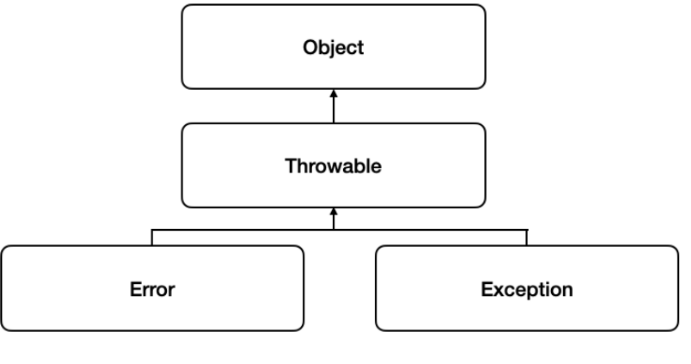
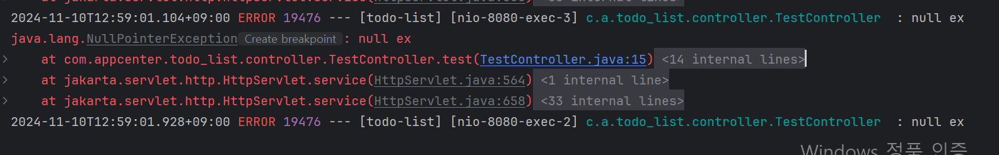
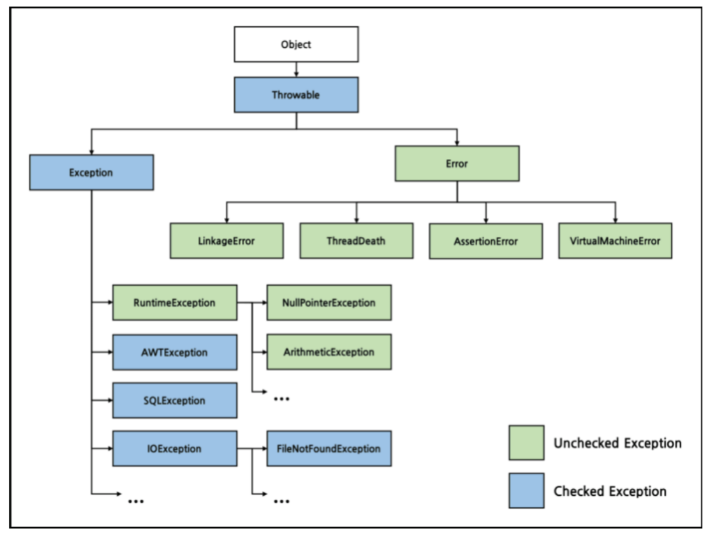
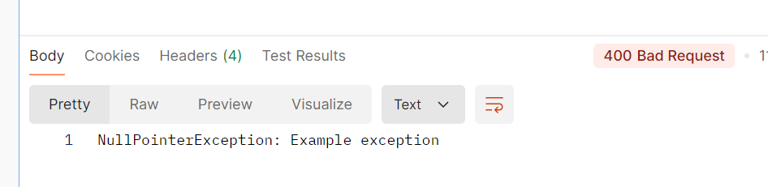
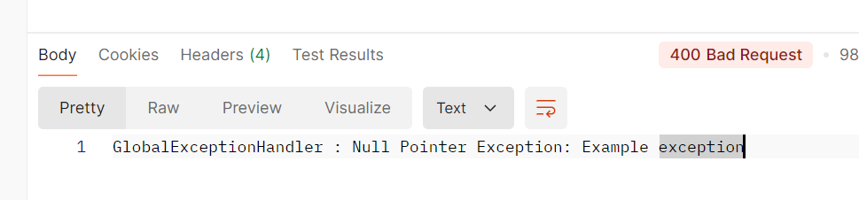
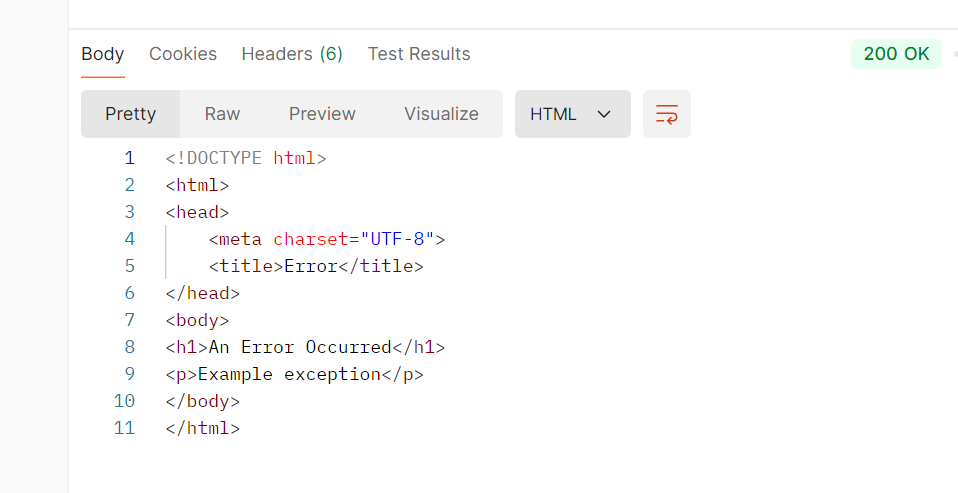
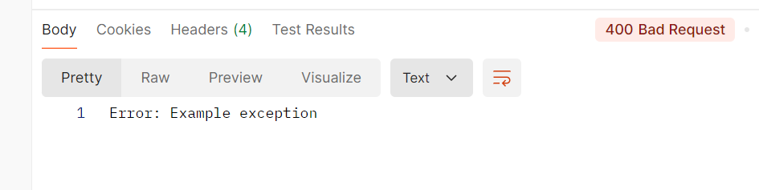

# 에러와 예외의 차이는 무엇일까요? Spring에서의 예외처리는 어떻게 진행할까요?

# 1. 예외 처리의 개념

## 1)에러와 예외의 차이는 무엇인가요?

- **오류**
    
    시스템이 종료되어야 할 수준과 같이 수습할 수 없는 심각한 문제
    
    개발자가 미리 예측하여 방지할 수 없다
    

- **예외**
개발자가 구현한 로직에서 발생한 실수나 사용자의 영향에 의해 발생
    
    개발자가 미리 예측하여 방지가능
    
    상황에 맞는 예외 처리(Exception Handle)를 해야 한다.
    

***Throwable** 

<div align="center">
    
</div>

오류와 예외 모두 Object 클래스를 상속 받는Throwable 클래스를 상속 받는다. 

오류나 예외에 대한 메시지를 담고 예외의 정보를 기록
**`getMessage(), printStackTrace()`**

```java
@GetMapping("/test")
public ResponseEntity<?> test() {
    try {
        throw new NullPointerException("null ex");
    } catch (Exception e) {
        log.error(e.getMessage());
        e.printStackTrace();
    }
    return null;
}
```


대표적인 오류

`StackOverflowError`: 호출의 깊이가 깊어지거나 재귀가 지속되어 stack overflow 발생 시 던져지는 오류

`OutOfMemoryError`: JVM이 할당한 메모리의 부족으로 더 이상 객체를 할당할 수 없을 때 던져지는 오류

대표적인 예외

`NullPointerException`: 객체가 필요한 경우에 null을 사용하려고 시도할 경우 던져지는/**던져질 수 있는** 예외

`IllegalArgumentException`: 메서드가 허가되지 않거나 부적절한 argument를 받았을 경우에 던져지는/**던져질 수 있는** 예외

**—> 예외는 오류와 다르게 개발자가 임의로 예외를 던질 수 있다.**

## 2)예외 처리의 방법  (예외 복구, 예외 처리 회피, 예외 전환)

- **예외 복구**
    
    발생한 예외를 잡아서 복구하는 방식
    
    try-catch를 통해 예외를 포착하고, 정상 흐름으로 돌아갈 수 있는 로직을 처리
    
    여러 예외를 catch할 수 있는데 무조건 구체적인 즉 상속관계에서 가장 자식부터 catch해야 함
    
    → 예로 가장 부모인 Exception이 맨 먼저 catch되면 다른 예외는 catch될 수 없기 때문
    

```java
try{
} catch (Exception e){
} catch (IOException e){
} finally {
}

--> X
```

- **예외 처리 회피**
    
    메서드 내에서 예외를 처리하지 않고, 상위 호출자에게 예외를 전달하는 방식
    
    호출한 쪽에서 예외 처리를 하도록 메서드 시그니처에 `throws` 키워드를 사용하여 던질 예외를 선언
    

```java
public void main() {
	try {
		add();
	} catch (SQLException e) {
	}
}

// 예시 1
public void add() throws SQLException {
    throw new SQLException();
}

// 예시 2 
public void add() throws SQLException {
    try {
    } catch(SQLException e) {
        // 로그를 출력하고 다시 날린다     
        throw e;
    }
}
```

- **예외 전환**
    
    발생한 예외를 다른 예외로 변환하는 방식
    
    하위 계층(호출되는 메서드)의 예외를 상위 계층(호출하는 메서드)에서 이해하기 쉬운 예외로 변환해 주로 계층 간 예외를 전달할 때 사용
    

```java
public void add(User user) throws DuplicateUserIdException, SQLException {
    try {
    } catch(SQLException e) {
	    throw DuplicateUserIdException(); // SQLException이 발생했지만 변환해서 던짐
    }
}
```

## 3. 자바의 예외 클래스는? (Checked Exception / Unchecked Exception)

Checked Exception과 UncheckedException의 가장 명확한 구분 기준

**---'꼭 예외처리를 해야 하는가'—-**

- **Checked Exception**
    
    컴파일 타임에 확인되는 예외로, 무조건 예외 처리
    
    `IOException`, `SQLException` 
    
    만일 컴파일 시점에 예외에 대해 처리(try/catch) 하지 않는다면 컴파일 에러가 발생
    
    또한 트랜잭션 중에 예외가 일어난다고 해도 Rollback이 안된다는 속성도 있습니다.
    
    예외가 발생하는 메서드에서 try-catch로 감싸거나 throws로 던짐
    

- **Unchecked Exception**
    
    실행과정 중 어떠한 특정 논리에 의해 발견되는 Exception
    
    주로 프로그래밍 실수에서 발생하며, 예외 처리가 필수가 아님
    
    `RuntimeException`을 상속한 예외들이 해당
    
    `NullPointerException`, `IndexOutOfBoundsException`
    
    예외 발생시 트랜잭션을 roll-back한다.
    

<div align="center">
    
</div>


# 2. Spring에서의 예외 처리

콘솔 애플리케이션을 구현할 때는 try / catch문을 사용

웹 애플리케이션에서는 예외 처리 방법은 따로 있음

### 1) @ControllerAdvice, @ExceptionHandler 은 무엇이며 또한 이들을 활용한 예외처리 방식은 무엇인가요?

특정 컨트롤러 내에서 예외를 처리하고 싶을 경우에는 컨트롤러 내에서 @ExceptionHandler를 사용

@Controller나 @RestController 빈 내에서 발생하는 특정 예외를 처리

@ExceptionHandler는 하나의 클래스 단위가 아니라 전체 클래스에 해당됨

둘이 같이 동작할 때는 컨트롤러 내의 @ExceptionHandler가 우선

**@ExceptionHandler**

```java
@GetMapping("/example")
public String example() {
    throw new NullPointerException("Example exception");
}

@ExceptionHandler(NullPointerException.class)
public ResponseEntity<String> handleNullPointerException(NullPointerException ex) {
    return new ResponseEntity<>("NullPointerException: " + ex.getMessage(), HttpStatus.BAD_REQUEST);
}
```

<div align="center">
    
</div>

**@ControllerAdvice**

```java
@ControllerAdvice
public class GlobalExceptionHandler {

    @ExceptionHandler(value = Exception.class)
    public ResponseEntity<String> handleException(Exception ex) {
        return new ResponseEntity<>("Error occurred: " + ex.getMessage(), HttpStatus.INTERNAL_SERVER_ERROR);
    }

    @ExceptionHandler(value = NullPointerException.class)
    public ResponseEntity<String> handleNullPointerException(NullPointerException ex) {
        return new ResponseEntity<>("GlobalExceptionHandler : Null Pointer Exception: " + ex.getMessage(), HttpStatus.BAD_REQUEST);
    }
}
```

<div align="center">
    
</div>

## 2. ControllerAdvice와 RestControllerAdvice의 차이가 무엇인가요?

- **응답 형식**
    - **@ControllerAdvice**
        
         -반환값을 뷰(View)로 해석하여 HTML을 렌더링
        
        -주로 MVC 패턴의 웹 애플리케이션에서 사용하며 예외 처리 메서드가 반환하는 값이 JSP, Thymeleaf 등의 템플릿 엔진을 통해 클라이언트에게 전달
        
    - **@RestControllerAdvice**
        
        -자동으로 `@ResponseBody`가 포함되어 있어, JSON 또는 XML 같은 데이터를 직접 클라이언트에 반환
        
        -REST API에서 JSON 응답을 제공할 때 사용
        
- **사용 용도**
    - **@ControllerAdvice**
        
        주로 웹 애플리케이션에서 예외가 발생할 경우 HTML 기반 에러 페이지를 반환할 때 유용예외를 처리한 후 클라이언트가 보게 될 뷰 페이지를 선택
        
    - **@RestControllerAdvice**
        
        RESTful API 설계에서 사용되며, JSON 형식의 에러 메시지나 응답 본문을 클라이언트에게 반환
        
        주로 REST API를 통해 데이터를 주고받는 환경(프론트랑 api할 때)에서 유용
        

- **@RestControllerAdvice**

```java
@RestController
@Slf4j
public class TestController {

    @GetMapping("/example")
    public String example() {
        throw new NullPointerException("Example exception");
    }
}

```

```java
@ControllerAdvice
public class WebExceptionHandler {

    @ExceptionHandler(value = NullPointerException.class)
    public String handleNullPointerException(Exception ex, Model model) {
        model.addAttribute("errorMessage", ex.getMessage());
        return "error/error-page";  // "error-page"는 HTML 뷰 이름
    }
}
```

resources/templates/error/error-page.html

```html
<!DOCTYPE html>
<html xmlns:th="http://www.thymeleaf.org">
<head>
    <meta charset="UTF-8">
    <title>Error</title>
</head>
<body>
    <h1>An Error Occurred</h1>
    <p th:text="${errorMessage}">An unexpected error occurred. Please try again later.</p>
</body>
</html>
```

<div align="center">
    
</div>

- **@ControllerAdvice**

```java
@RestControllerAdvice
public class ApiExceptionHandler {

    @ExceptionHandler(value = NullPointerException.class)
    public ResponseEntity<String> handleNullPointerException(Exception ex) {
        return new ResponseEntity<>("Error: " + ex.getMessage(), HttpStatus.BAD_REQUEST);
    }
}
```
<div align="center">
    
</div>

## 3.ControllerAdvice 내 우선 순위와 ExceptionHandler 내 우선 순위

1. **@ControllerAdvice  내 우선 순위**
    
    @Order
    
    order가 같으면 디렉토리에서 위에 위치한게 있는게 우선
    

```java
@ControllerAdvice
@Order(1) // 우선 순위가 높음
public class HighPriorityExceptionHandler {

    @ExceptionHandler(NullPointerException.class)
    public ResponseEntity<String> handleNullPointerException(Exception ex) {
        return new ResponseEntity<>("High priority handler: NullPointerException", HttpStatus.BAD_REQUEST);
    }
}

@ControllerAdvice
@Order(2) // 우선 순위가 낮음
public class LowPriorityExceptionHandler {

    @ExceptionHandler(NullPointerException.class)
    public ResponseEntity<String> handleNullPointerException(Exception ex) {
        return new ResponseEntity<>("Low priority handler: NullPointerException", HttpStatus.BAD_REQUEST);
    }
}
```

1. **@ExceptionHandler** 
    
    구체적인 것 우선
    
    즉 부모자식 관계에서 가장 자식이 우선
    

```java
@ControllerAdvice
public class SpecificExceptionHandler {

    @ExceptionHandler(NullPointerException.class) // 구체적인 예외-> 이 예외가 우선
    public ResponseEntity<String> handleNullPointerException(Exception ex) {
        return new ResponseEntity<>("Handled NullPointerException", HttpStatus.BAD_REQUEST);
    }

    @ExceptionHandler(RuntimeException.class) // 상위 예외
    public ResponseEntity<String> handleRuntimeException(Exception ex) {
        return new ResponseEntity<>("Handled RuntimeException", HttpStatus.INTERNAL_SERVER_ERROR);
    }
}
```