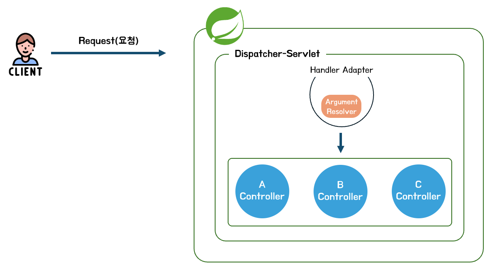

# 4주차

# 1. 유효성 검사란?

## a. 유효성 검사가 무엇일까요?

**유효성 검사**란 외부 **요청**(Request)로부터 전달된 데이터들이 형식에 따라 잘 전달이 되었는지, 예상되는 값들이 들어왔는지 즉, **유효한 데이터인지 확인하는 절차**입니다.

## b. 유효성 검사를 왜 해야할까요?

그렇다면, 이 유효성 검사를 왜 진행해야 할까요? 여러가지 이유가 있겠지만, 저는 아래처럼 크게 두 이유가 있다고 생각하는데요.

- **서버 장애 최소화**
- **데이터베이스 무결성 유지**

### **🍀** 서버 장애 최소화

보통 구글, 네이버와 같은 대형 사이트들을 서핑할 때, 서버가 아예 다운되어서 접속이 안되었던 경험이 있으신가요? 저는 트래픽이 몰려서 마비가 된 경우는 있었는데, 서버가 완전히 죽어버린 경우는 잘 못 본 것 같습니다.              

서버에서 에러가 생기면, 해당 부분과 연관된 부분만 수정해서 다시 릴리즈하면 되지만, 서버가 아예 다운된다면 다른 서비스들에도 지장이 가니 꽤나 큰 문제가 발생할 겁니다. 

이러한 측면에서 유효성 검사도 서버에 문제가 생기지 않게 **위험성을 최소화하는 방법** 중에 하나라고 생각합니다. **형식에 맞지 않는 데이터가 들어오면, 이 데이터는 서버에 대한 장애를 일으킬 확률이 높으니 사전에 처리**해주는 느낌이죠. 

### **🍀** 데이터베이스 무결성 유지

DB의 무결성이라고 하면, 데이터베이스에는 **결함이 없는 데이터가 들어가야 한다는 원칙**을 의미합니다. 이 무결성을 유지하며, 올바른 데이터를 참조하고 사용자에게 전달하는 것이 중요한 원칙입니다. 

## c. 서비스에서 유효성 검사

여러분은 프론트앤드와 백앤드 중 어디에서 유효성 검사를 해야한다고 생각하시나요? 개발을 시작한지 얼마 되지 않았을 때에는 ***데이터를 직접 다루고 까보는 곳은 서버니깐, 서버만 해주면 되는거 아니야?*** 라고 생각했지만, 관점을 조금 더 넓게 보니 **클라, 서버 둘 다 해주는 게 맞다**고 생각이 들었습니다. 

만약, 서버에서만 유효성 검사를 진행하면 **클라이언트 쪽에서 필터링되지 않은 요청들이 마구잡이로 들어오기 때문에, 서버에 대한 부하가 커지게 될 것**입니다.

반대로 클라이언트에서만 하면, 물론 스크립트를 거치고 들어오는 요청들은 필터링이 되겠지만 **스크립트를 거치지 않고 직접 요청을 날리는 경우**(포스트맨, 스웨거만 해도 서버로 직접 요청을 날리죠) **클라이언트 측에서 요청을 필터링할 수 있는 방법이 없**고 서버는 직격탄을 맞겠죠. 

❗️따라서! **유효성 검사는 프론트, 백 둘 다** 해주어야합니다. 

# 2. 스프링에서의 유효성 검사

## a. Spring Bean Validation

**Bean Validation**이란, **어노테이션(@)**을 통해 제약 조건을 설정하여 간편하게 데이터를 검증할 수 있도록 도와주는 API에 대한 정의를 의미합니다. 

## b. @Valid와 @Validated

### @Valid

`@Valid`는 JSR 표준 스팩으로 **Bean Validator**를 통해 객체를 비롯한 데이터에 대한 제약 조건을 검사하라고 **지시하는 어노테이션**입니다. 실제로는 **`LocalValidatorFactoryBean`**이 검사를 수행하게 되는데, 이 친구는 

```java
implementation 'org-springframework.boot:spring-boot-starter-validation'
```

위 의존성을 추가해주게 되면, 자동으로 등록되어 사용할 수 있습니다.

### @Valid의 동작 과정



먼저, 클라이언트의 요청이 **`Dispatcher Servlet`**(프론트 컨트롤러)에 도착하게 되면, Dispatcher Servlet의 **Handler Adapter의 HandlerMapping을 통해 적절한 컨트롤러**를 찾습니다.

컨트롤러를 찾았다면 해당 요청을 처리할 메소드와 바인딩하는 과정을 거치게 되는데, 이 과정에서 요청에 포함된 데이터가 파라미터에 바인딩되기 전! **Valid로 시작**하는 어노테이션이 앞에 붙어 있다면, 유효성 검사를 수행하게 됩니다. ~~(**@ValidTodo와 같이 유효성 검사를 커스텀해서 사용할 수 있도록 Valid로 시작하는 어노테이션을 대상으로 유효성 검사를 진행하게 됩니다.)**~~

만약 유효성 검사를 제대로 통과하지 못했다면, **`MethodArgumentNotValidException`**가 발생하게 됩니다. 

### @Validated와 동작 과정

@Valid를 단독으로, 직접적으로 사용할 수 있는 계층은 **컨트롤러 계층**입니다. 따라서, 컨트롤러 계층이 아닌 곳에서 사용하기 위해서는 **@Validated 어노테이션을 활용**해야합니다. 

~~컨트롤러 계층에서도 @QueryParam이나 @PathVariable에 대해 유효성 검사를 진행하려면, @Validated를 활용해야하는데, 추후에 이어서 설명하겠습니다.~~

`@Validated`는 **스프링 프레임워크에서 제공하는 어노테이션**으로, **AOP** 기반으로 동작합니다. 만약, 클래스 래밸에 **@Validated**을 적용하면, 유효성 검사를 위한 AOP 인터샙터인 `MethodValidationInterceptor`가 등록됩니다. 그리고 해당 **클래스 내의 메소드가 호출되면, 인터샙터가 요청을 가져와 유효성 검사를 실행**하게 됩니다. 

따라서, 컨트롤러가 아닌 레이어(예를 들어 서비스)에서 유효성 검사를 진행하려면, 클래스 레벨에 `@Validated`, 메소드 내의 파라미터에 `@Valid`를 적용하여 수행할 수 있습니다. 예시는 아래와 같습니다.

```java
@Service
@Validated
@RequiredArgsConstructor
public class TravelogService {
	
    public TravelogsResponseDto searchTravelogs(@Valid String mainPlace, String sortBy) {
        List<TravelogEntity> travelogs;
        if ("likes".equalsIgnoreCase(sortBy)) {
            travelogs = travelogRepository.findAllByMainPlaceContainingOrderByLikesDesc(mainPlace)
                    .orElse(List.of());
        } else {
            travelogs = travelogRepository.findAllByMainPlaceContainingOrderByCreatedAtDesc(mainPlace)
                    .orElse(List.of());
        }

        List<TravelogSummaryDto> travelogSummarys = travelogs.stream()
                .map(this::convertToSummaryDto)
                .collect(Collectors.toList());

        return new TravelogsResponseDto(travelogSummarys, travelogSummarys.size());
    }
}
```

`@Validated`는 AOP를 기반으로 동작하기 때문에 **Spring Bean으로 등록되어 있다면, 적용이 가능**합니다. 

### @Validated와 @RequestParam

`@RequestParam`이 적용된 파라미터에 유효성 검사를 수행하고 싶다면, 아래처럼 컨트롤러 레이어에 **@Validated를 적용**해야 합니다.

```java
@RestController
@RequestMapping("/api/users")
@Validated  // 컨트롤러에 @Validated 적용
public class UserController {

   @GetMapping("/users")
   public ResponseEntity<List<User>> searchUsers(
       @RequestParam 
       @NotBlank(message = "검색어는 필수입니다") // 유효성 검사 조건 
       @Size(min = 2, max = 10, message = "검색어는 2-10자 사이여야 합니다")
       String keyword,

       @RequestParam
       @Min(value = 1, message = "페이지 번호는 1 이상이어야 합니다")
       @Max(value = 100, message = "페이지 번호는 100 이하여야 합니다") 
       Integer page
   ) {
       List<User> users = userService.searchUsers(keyword, page);
       return ResponseEntity.ok(users);
   }

```

## c. 유효성 검사 어노테이션

| Annotation | Description |
| --- | --- |
| `@Size` | **문자열의 길이 검사** |
| `@Notnull` | **null 검사** |
| `@NotEmpty`  | **null, “” 검사** |
| `@NotBlank` | **null, “”, “ “ 검사** |
| `@Past(OrPresent)` | **과거 날짜만 허용(혹은 현재도 허용)** |
| `@Future(OrPresent)` | **미래 날짜만 허용(혹은 현재도 허용)** |
| `@Pattern` | **정규식을 활용하여 검사** |
| `@Min/@Max` | **최대, 최소 검사** |
| `@AssertTrue/False` | **조건의 참/거짓 검사** |

### d. 유효성 검사에 대한 고찰

To be Continue..