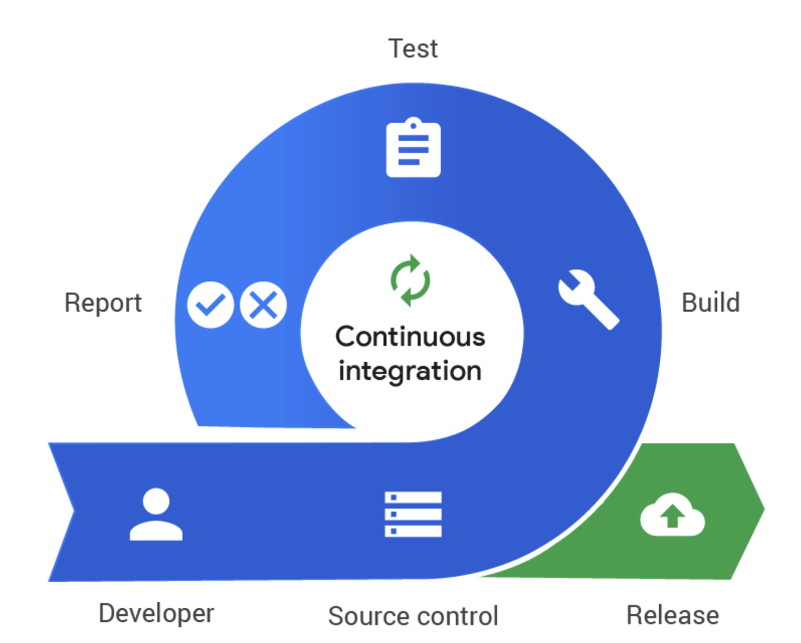
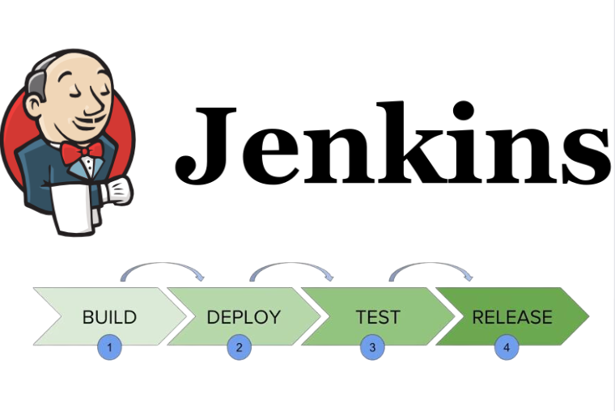

# 5주차

# CI/CD란 무엇일까요?

## 1. CI/CD의 의미

### a. CI(Continuous Integration)



출처:artist-developer

<aside>
💁🏻‍♂️

**CI(Continuous Integration)**은 서비스에 **변경/수정 사항이 생기면, 해당 사항에 대해 빌드, 테스트를 진행하여 지속적으로 메인 레포지토리에 통합**되는 것을 의미합니다.

</aside>

만약, 배포가 끝나 상용화 중인 서버에 예상하지 못한 버그가 터져서 급히 버그를 수정해야하는 상황이라고 가정해봅시다. 서버 일부를 수정하여 버그를 잡는데 성공하였지만, **그 수정 사항이 서버의 다른 부분에 영향을 주지는 않는지**, **빌드가 정상적으로 되는지**와 같은 것들도 반드시 검토해야 정상적으로 서비스를 다시 재운용할 수 있을 것입니다. 

**CI**가 이루어지는 과정은 아래와 같습니다.

- **개발자가 코드를 래포지토리에 Push하면,**
- **래포지토리의 코드로부터 단위 테스트를 진행하고 빌드한 후,**
- **다른 컴포넌트들과 잘 통합되는지 확인**

**∴ ❗️ 빌드 테스트의 자동화 과정 ❗️**

이 일련의 과정을 통해, 수정 사항이 기존 애플리케이션에 대해 문제가 발생하지 않음을 보장할 수 있습니다. 

### b. CD(Continuous Delivery/Deployment)

**CD(Continuous Delivery/Deployment)**는 **지속적인 서비스 제공**과 **지속적 배포** 두 가지의 의미가 혼용되어 쓰입니다.

간단하게 말해, 배포 과정을 자동화하여 주기적인 배포를 가능하게 하고 서비스적인 측면에서도 서비스 중단 없이 변경사항을 반영할 수 있게끔 해주는 과정입니다.

1. **Continuous Delivery**
    
    → 추가/수정된 코드가 프로덕션 환경에 실제로 배포될 준비가 되도록 하는 과정
    
    → 코드의 상태가 항상 배포 가능한 상태임을 유지함
    
2. **Continuous Deployment**
    
    → 위 과정이 모두 완료되면, 프로덕션 환경에 적용되는 배포 과정
    

### c. CI/CD 과정

→ 만약 개발자가 **코드를 수정하고 main 브랜치에 커밋**했다고 가정해봅시다. 그럼 아래 스크립트의 `push:branches: [ ”main” ]`이 트리거 되어 이어지는 **job**들이 수행됩니다. 

```yaml
name: Deploy to remote server
env:
  ACTIONS_RUNNER_DEBUG: true
on:
  push:
    branches: [ "main" ]
  pull_request:
    branches: [ "main" ]
```

**step**에 따라 CI/CD 과정이 이루어지고 있습니다. **Build Tool**로 **Gradle**을 선택하고, **Gradle**에게 실행 권한을 부여하며, 마지막에는 **Build**를 수행하고 있네요. 

```yaml
jobs:
  build:
    runs-on: ubuntu-latest
    steps:
      - uses: actions/checkout@v3

      - name: Set Java
        uses: actions/setup-java@v3 
        with:
          java-version: '17'
          distribution: 'temurin'

      - name: Setup Gradle
        uses: gradle/gradle-build-action@v2
        with:
          gradle-home-cache-cleanup: true

      - name: Grant execute permission for gradlew
        working-directory: ./todo
        run: chmod +x ./gradlew

      - name: Run build with Gradle Wrapper
        working-directory: ./todo
        run: ./gradlew clean build -x tes
```

deploy는 실제 배포 과정의 일부입니다. 원격 서버로 **빌드 파일**과 **해당 파일을 실행시킬 스크립트 파일**을 **SCP 프로토콜**을 통해 전송하고 있습니다.

```yaml
  deploy:
    needs: build
    runs-on: ubuntu-latest
    steps:
      - uses: actions/checkout@v3

      - name: Send files to the server
        uses: appleboy/scp-action@master
        with:
          host: ${{ secrets.HOST }}
          username: ${{ secrets.USER }}
          password: ${{ secrets.PASSWORD }}
          port: ${{ secrets.SSH_PORT }}
          source: "todo/scripts/deploy.sh,todo/builds/libs/*.jar"
          target: "/home/${{ secrets.USER }}/download/todo"
          strip_components: 2

      - name: Deploy remote ssh commands
        uses: appleboy/ssh-action@master
        with:
          host: ${{ secrets.HOST }}
          username: ${{ secrets.USER }}
          password: ${{ secrets.PASSWORD }}
          port: ${{ secrets.SSH_PORT }}
          script_stop: true
          script: |
            chmod +x /home/${{ secrets.USER }}/download/todo/deploy.sh
            sh /home/${{ secrets.USER }}/download/todo/deploy.sh
```

아래는 **배포 스크립트**입니다. 해당 배포 스크립트가 원격 서버에서 위 `Deploy remote ssh commands` **Step**의 `script`에 의해 실행되게 됩니다.

```yaml
#!/bin/bash
echo "> 현재 USER NAME을 가져옵니다."
CURRENT_USER=$(whoami)

echo "> download 폴더에서 build된 .jar 파일을 가져옵니다."
cp /home/$CURRENT_USER/download/todo/builds/libs/*.jar /home/$CURRENT_USER/deploy/

echo "> deploy 폴더에서 plain.jar 파일을 찾고, 파일이 있다면 삭제합니다."
find /home/$CURRENT_USER/deploy -name "*plain*" -delete 2>/dev/null || true

echo "> download 폴더를 삭제합니다."
rm -rf /home/$CURRENT_USER/download

echo "> 작동 중인 애플리케이션을 찾습니다."
CURRENT_PID=$(pgrep -f todo-0.0.1-SNAPSHOT.*\.jar)

if [ -z "$CURRENT_PID" ]; then
    echo "> 실행 중인 애플리케이션이 없습니다."
else
    echo "> kill -9 $CURRENT_PID"
    kill -9 $CURRENT_PID
    sleep 3
fi

echo "> 새 애플리케이션을 시작합니다."
cd /home/$CURRENT_USER/deploy
nohup java -jar \
    -Dspring.profiles.active=prod \
    -Dserver.port=5152 \
    $(ls -t *.jar | grep -v 'plain' | head -n1) \
    1>stdout.txt 2>stderr.txt &

echo "> 새 애플리케이션이 시작되었습니다."
sleep 3
```

이 과정을 성공적으로 마무리하면, 원격 서버에 배포하는 과정이 마무리됩니다. 

---

## 2. 다양한 CICD 툴

### a. Jenkins



- JRE에서 동작하는 CICD 툴
- 다양한 플러그인을 통해 각종 작업들을 자동화하여 처리할 수 있다.
- 도커, 깃, aws와 관련된 플러그인 또한 사용할 수 있으며, 다양한 환경이 제공된다.
- Master/Slave 구조를 기본으로 동작
    - **Master**
        
        → **Controller라고** 불리며, Slave에 해당되는 작업들을 모니터링하고 관리한다
        
    - **Slave**
        
        → **Agent**라고 불리며, 실제 파이프라인 작업을 수행한다. 여러 환경에서 작동하며, 작업을 분산해 서버에 부하를 감소하는 역할을 한다.
        
- 선언적 특성 활용
    
    

### b. GoCD


- ThoughtWorks에서 개발한 CI/CD 서버
- 복잡한 배포 파이프라인을 시각화 가능(VSM)
- 대규모 배포를 안정적으로 지원
- Self Hosted 방식으로 제공되기 때문에, 상시 가동되는 안정적인 서버가 필요