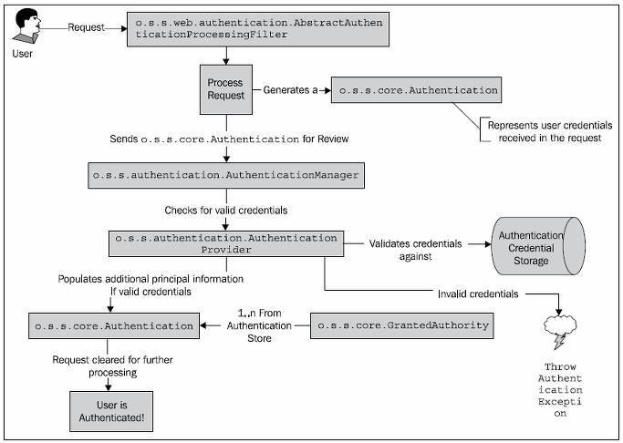
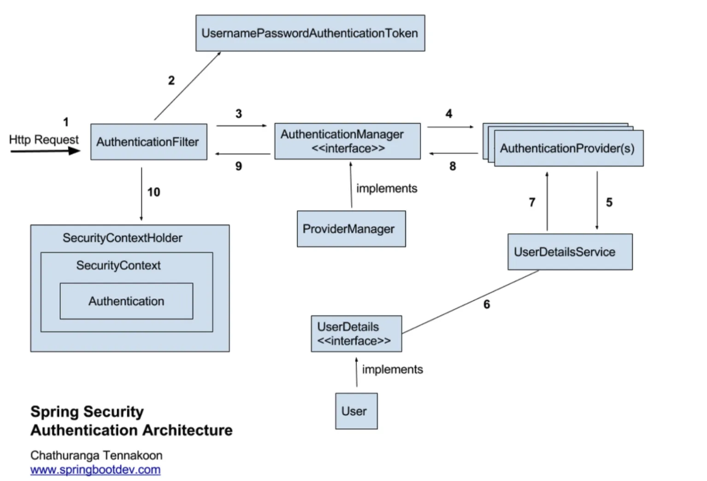
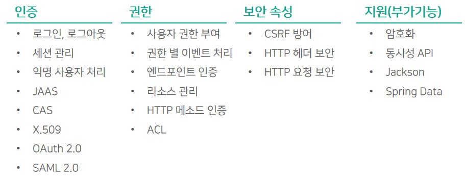
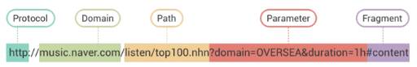

# 6주차

# 1. Spring Security란 무엇인가요?

## a. 인증과 인가란 무엇일까요?

### 인증(Authentication)

**인증(Authentication)**은 **특정 리소스에 접근을 시도하는 주체가 본인이 맞는지 확인하는 과정**입니다. 예를 들어, 특정 사용자가 한준서의 자원에 접근하려고 하면, 해당 사용자가 한준서가 맞는지 확인해야겠죠. 이 과정이 바로 인증입니다. 

### 인가(Authorization)

**인가(Authorization)**는 **인증을 마친 사용자가 해당 자원에 접근할 수 있는 권한이 있는지 검사하는 과정**입니다. 인증과 인가를 한번에 살펴보도록 합시다.


수원시에 위치한 삼성전자 본사에는 **여러 사업부가 한 건물에 위치**하고 있습니다. 삼성전자 반도체 사업부 신입사원인 한준서는 아침 9시, **삼성전자 건물 1층의 출입 게이트를 통과하기 위해 안면인식을 하고 통과**하였습니다.

엘레베이터에 탑승한 후 정신이 없는 한준서는 잘못하고 반도체 사업부가 아닌, **다른 부서가 위치한 층에 내려 사무실에 들어가려고 하는 찰나에 보안 요원이 이를 막아**섰습니다.

당연히 본인의 부서가 아닌 다른 부서에 들어가려고 했으니 출입이 안되는 것이 당연합니다. 이 과정에서 **인증**과 **인가**를 모두 살펴볼 수 있는데요

- 삼성전자 건물 1층의 출입 게이트를 통과하는 과정 → **인증**
- 본인의 부서에 들어가는 과정 → **인가**

## b. Spring Security의 구조





**Spring Security**는 스프링 프레임워크의 하위 요소로 애플리케이션 내에서 인증, 인가를 비롯한 보안을 담당하는 역할을 합니다. **스프링 MVC와는 독립적으로 동작**하며 아래와 같은 다양한 보안적 기능을 제공합니다.



**Spring Security**는 **Principal**과 **Credential** 패턴의 인증 방식을 사용하는데 각 요소가 의미하는 바는 아래와 같습니다. 

- **`Principal`** → **특정 리소스에 접근을 시도하는 주체**
- **`Credential`** → **Principal이 유효한지 확인하는 수단**

즉, 아이디와 비밀번호 정도로 생각하시면 쉽습니다.

위에서 살펴본 개념을 통해 **Spring Security**가 동작하는 방식을 살펴보도록 하겠습니다. 

## c. Spring Security의 동작 과정


로그인 HTTP Request을 받은 상황을 가정하여, 단계별로 살펴보도록 하겠습니다.

### 1. HTTP Request가 AuthenticationFilter에 도착

로그인 요청이 **Spring Security**의 시작점인, **`AuthenticationFilter`**에 도착합니다. 로그인 요청에는 사용자 입력(**아이디**, **비밀번호**)가 포함되어 있다고 가정합니다. 

### 2. AuthenticationFilter가 UsernamePasswordAuthenticationToken 생성

사용자의 **아이디**와 **비밀번호**를 기반으로 **`UsernamePasswordAuthenticationToken`**을 생성합니다. 이를 **인증용 객체**라고 부릅니다.

### 3. AuthenticationManager가 인증용 객체를 넘겨받아 인증 실행

ProviderManager의 구현체인 AuthenticationManager가 여러 AuthenticationProvider를 통해 실제 인증 과정을 거칩니다. 

AuthenticationManager는 인증용 객체의 타입을 확인하고 적절한 AuthenticationProvider를 선택해 인증을 시도하게 됩니다.

- **UsernamePasswordAuthenticationToken** → **`DaoAuthenticationProvider`**
- **JwtAuthenticationToken** → **`JwtAuthenticationProvider`**
- **OAuth2LoginAuthenticationToken** → **`OAuth2LoginAuthenticationProvider`**

각 **AuthenticationProvider**는 **support** 함수를 구현하고 있어서 자신이 처리할 수 있는 **인증용 객체인지 확인할 수 있습니다.**

```java
public boolean supports(Class<?> authentication) {
    return UsernamePasswordAuthenticationToken.class.isAssignableFrom(authentication);
}    
```

### 4. UserDetailService를 통해 사용자 정보를 가져오고 인증 처리

**`AuthenticationProvider`**가 **`UserDetailService`**에게 **username**을 전달하면, 해당 **username**에 해당하는 사용자의 정보를 기반으로 **UserDetails** 객체를 생성하고 **`AuthenticationProvider`**에게 전달합니다.

**`AuthenticationProvider`**는 **사용자 입력 정보**와 **UserDetails**를 비교하여 실제 인증을 처리하게 됩니다.

### 5. 새로운 인증용 객체를 생성한 후, AuthenticationFilter에 반환

인증이 성공적으로 마무리 되면, **UserDetails**가 포함된 새로운 **`UsernamePasswordAuthenticationToken`**을 생성하고 **`AuthenticationFilter`**에 전달합니다.

### 6. SecurityContextHolder → SecurityContext → Authentication

해당 인증용 객체가 **SecurityContextHolder**, **SecurityContext**, **Authentication**를 각각 거쳐 저장되며, 만약 인증에 실패한 경우에는 **`AuthenticationException`** 예외가 발생하게 됩니다.

---

# 2. CORS란 무엇일까요?

## a. origin은 무엇일까요?

**Origin**은 본래 뜻 그대로 **출처**라는 뜻입니다. 아래 URL을 보면 **Protocol**, **Domain**, **Path**, **Parameter**, **Fragment**로 이루어져 있는 것을 알 수 있는데, 여기서 **출처**는 **Protocol**, **Domain**으로 구성됩니다. 



그럼 아래 아래 두 URL은 같은 출처일까요?

- **http://music.naver.com**
- **https://music.naver.com**

→ **다른 출처**입니다. **호스트는 일치하지만 프로토콜이 다릅**니다. 즉 각 호스트가 Listen하고 있는 포트번호가 다름을 의미합니다. **http는 80포트**, **https는 443포트**를 사용하는데, 그럼 각 URL은 

- **music.naver.com:80**
- **music.naver.com:443**

위와 같이 표시할 수 있고, 따라서 **서로 다른 출처를 가지게 됩니다.**

## b. 동일 출처 정책이 무엇인가요?

**`SOP`**(Same-Origin Policy)는 **한 Origin에서 로드된 문서 또는 스크립트가 다른 Origin의 리소스와 상호작용할 수 있는 방법을 제한**하는 중요한 보안 메커니즘입니다. 

사실 이렇게 제한적인 환경은 보안적인 측면에서는 좋지만, 다른 도메인간의 통신, 데이터 교환 등을 불가능하게 합니다. 이를 해결하기 위해 **CORS**가 등장합니다.

## c. Spring에서의 CORS

**CORS**(Cross Origin Resource Sharing)은 **출처가 다른 도메인의 요청이라도 접근을 허용해주거나 차단하는 정책입니다.** 

저는 처음 이 **`CORS`**를 접했을 때 **개발을 하는 사람이 접하게 되는 첫번째 관문**이라고 해서 ***아 CORS가 정말 무서운 에러구나*** 라고 생각했었는데요. 사실 **`CORS`**는 에러가 아니라 **`SOP`**에서의 단점을 해결하고 서로 다른 도메인 간의 자원 공유가 가능하게 해주는 정책이구나 라는 것을 알게 되었습니다.

보통 개발 단계에서는 **`CORS`**에 대한 설정을 하기 귀찮아서 **`와일드 카드(*)`**로 모든 도메인에 대한 자원 공유 정책을 열어주곤 했는데요. 사실 본인이 테스트할 환경의 도메인만 자원 공유를 허용하게 해주면 됩니다. 그럼 스프링에서 **`CORS`**를 어떻게 설정하는지 살펴보도록 하겠습니다.

### 1. 전역 설정

- **WebConfig**
    
    ```java
    @Configuration
    public class WebMvcConfig implements WebMvcConfigurer {
        @Override
        public void addCorsMappings(CorsRegistry registry) {
            registry.addMapping("/**") // cors를 적용할 URL 패턴
                .allowedOrigins("http://localhost:3000") // 자원 공유를 허락할 도메인
                .allowedMethods("GET", "POST", "PUT", "DELETE"); // 허용할 메소드
        }
    }
    ```
    
- **SecurityConfig**
    
    ```java
    @Configuration
    @EnableWebSecurity
    public class SecurityConfig {
    
        @Bean
        public CorsConfigurationSource corsConfigurationSource() {
            CorsConfiguration configuration = new CorsConfiguration();
            configuration.setAllowedOrigins(Arrays.asList("http:/localhost:3000"));
            configuration.setAllowedMethods(Arrays.asList("GET", "POST", "PUT", "DELETE"));
            configuration.setAllowedHeaders(Arrays.asList("*"));
            
            UrlBasedCorsConfigurationSource source = new UrlBasedCorsConfigurationSource();
            source.registerCorsConfiguration("/**", configuration);
            return source;
        }
    }
    ```
    
    - **FilterChain**
        
        ```java
        @Bean
        public SecurityFilterChain securityFilterChain(HttpSecurity http) throws Exception {
          http
                  .cors((corsCustomizer -> corsCustomizer.configurationSource(new CorsConfigurationSource() {
        
                      @Override
                      public CorsConfiguration getCorsConfiguration(HttpServletRequest request) {
        
                          CorsConfiguration configuration = new CorsConfiguration();
        
                          configuration.setAllowedOriginPatterns(Collections.singletonList("*"));
                          configuration.setAllowedMethods(Collections.singletonList("*"));
                          configuration.setAllowedHeaders(Collections.singletonList("*"));
                          configuration.setMaxAge(3600L);
        
                          configuration.setExposedHeaders(Collections.singletonList("Authorization"));
        
                          return configuration;
                      }
                  })))
        				... 
          return http.build();
        }
        ```
        

### 2. 컨트롤러 설정

- **@CrossOrigin**
    
    ```java
    @RestController
    @CrossOrigin(origins = "http://allowed-origin.com")
    public class MyController {
    	// 컨트롤러 로직	
    }
    ```
    

### 3. CORS 관련 이것저것

- **`setAllowedOriginPatterns`** vs **`setAllowedOrigins`**
    
    
    - **`setAllowedOrigins`**
        
        → 정확히 일치하는 URL 대상으로 적용 가능, **중복해서 setAllowedOrigins 불가.**
        
        → **`allowCredentials = true`**일 때, **와일드카드(*)** 사용 불가.
        
    - **`setAllowedOriginPatterns`**
        
        → 요즘 권장되는 방식
        
        → **`allowCredentials = true`**일 때, **와일드카드(*)** 사용 불가.
        

❗️**allowCredentials**를 **true**로 설정하고 와일드카드를 사용하기 위해 각 **메소드의 인자 값으로 List.of(”*”)**을 주고 우회하는 경우가 있는데, **절대 권장되는 방법이 아니라고 합니다.**

**예시코드**

```java
@Bean
public CorsConfigurationSource corsConfigurationSource() {
	  CorsConfiguration configuration = new CorsConfiguration();
	  configuration.setAllowedOriginPatterns(List.of("*")); // 우회하는 방법
	  configuration.addAllowedMethod("*");
	  configuration.addAllowedHeader("*");
	  configuration.setExposedHeaders(List.of("*")); 
	  configuration.setAllowCredentials(true);
	  UrlBasedCorsConfigurationSource source = new UrlBasedCorsConfigurationSource();
	  source.registerCorsConfiguration("/**", configuration);
	  return source;
}
```